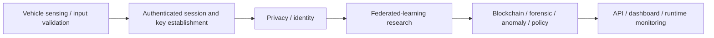

# OmniGuard V2X

**Post-quantum-aware blockchain security research platform for connected and autonomous vehicles**

**Current public version:** `v3.0.3`  
**Release channel:** Research hardening  
**Developer / Project Architect & Lead Developer:** Md Shahanur Islam Shagor

OmniGuard V2X is a research and bench-validation framework that combines authenticated vehicle telemetry, blockchain integrity, V2X trust, post-quantum key operations, privacy commitments, decentralized identity, anomaly monitoring, incident response, federated-learning experiments, hardware bridges, and reproducible security validation.

> **Research boundary:** v3.0.3 is not production-certified, vehicle-safety-certified, formally verified, or a substitute for an OEM PKI/HSM deployment. The project does not introduce new cryptographic primitives; its contribution is system integration plus validation transparency.

## v3.0.3 Highlights

v3.0.3 focuses on durable PQC identity, historical trust, rollback/recovery safety, authenticated local runtime startup, and release integrity.

- Durable encrypted ML-DSA-44 / ML-KEM-512 software keystore.
- AES-256-GCM protection for software-stored private PQC material.
- Stable key identifiers across process restarts.
- Guarded local PQC key rotation with encrypted previous-keystore backup.
- Signed old-to-new ML-DSA transition evidence.
- Bounded historical public-key trust keyring.
- Mixed-generation native ledger verification.
- Authenticated local rollback anchor with explicit no-auto-restore policy.
- Real liboqs native validation; simulated PQC is not part of the supported v3.0.3 build path.
- Opt-in PKCS#11 v3.2 hardware PQC adapter with runtime evidence checks.
- Secure local credential bootstrap with independent high-entropy secrets.
- Authenticated Go loopback backend with stale-process detection and bounded readiness.
- Windows runtime smoke validation using a real freshly built Go backend process.
- Commit-bound integrity manifest, SBOM, provenance, secret scan, validation reports, and SHA-256 release checksums.

See `docs/releases/v3.0.3.md` for the complete release notes and `docs/releases/v3.0.3-checklist.md` for the guarded release process.

## Security Model at a Glance

| Area | v3.0.3 status |
|---|---|
| Native data at rest | AES-256-GCM |
| Native signature | ML-DSA-44 via real liboqs |
| Native KEM | ML-KEM-512 via real liboqs |
| Historical ML-DSA verification | Supported for explicitly admitted generations |
| Historical ML-KEM re-decapsulation | Not supported; historical private KEM keys are intentionally not retained |
| Software PQC provider | Implemented; private material is encrypted but exportable to the software process |
| PKCS#11 v3.2 provider | Opt-in adapter implemented; runtime hardware evidence required |
| TPM2 provider | No concrete v3.0.3 adapter; fails closed |
| Generic HSM provider | No concrete v3.0.3 adapter; fails closed |
| Hardware monotonic rollback protection | Not implemented |
| Production PKCS#11/HSM token validation | Not claimed |
| Go local control API | HMAC-SHA256 authenticated, timestamp/nonce replay defense, loopback only |
| Python fallback from Go backend | Disabled by default |
| Classical ECDH-P256 fallback | Disabled by default; classical if explicitly enabled |

### Hybrid-security boundary

The native C++ v3.0.3 path uses real standardized ML-DSA-44 and ML-KEM-512. The wider research platform still contains classical components such as Pedersen commitment binding and Schnorr-style proof assumptions. Therefore OmniGuard V2X does **not** claim end-to-end post-quantum security.

Pedersen commitments operate in `COMMIT_ONLY` mode by default. Aggregate statistics such as mean velocity are **not recoverable from commitments alone**; openings or a separate secure-aggregation / zero-knowledge disclosure protocol would be required.

## Architecture

The current project is organized as **six implemented prototype layers**:

1. **L1 — Vehicle sensing and input validation**  
   `hardware_bridge.py`, `pi_sensor_node.py`, `vehicle_sensors.py`, `SmartCarSensorNode.ino`, optional camera module.

2. **L2 — Cryptographic session and key establishment**  
   `sync_protocol.py`, `v2x_protocol.py`, authenticated envelopes, replay defense, session secrets, crypto-agility controls.

3. **L3 — Privacy and identity**  
   `zkp_privacy.py`, `did_identity.py`, Pedersen-style commitments, proof checks, Lamport one-time identity authenticity.

4. **L3.5 — Federated-learning research layer**  
   `federated_learning.py`, `fl_trainer_node.py`, local updates, clipping and prototype poisoning sanity checks.

5. **L4 — Blockchain, forensic, anomaly and policy layer**  
   `blockchain.py`, `native/secure_blockchain_v303.cpp`, `smart_contracts.py`, `edge_layer.py`, `anomaly_detector.py`.

6. **L5 — API, dashboard and runtime monitoring**  
   `main.py`, `dashboard.py`, `smartcar_backend.py`, `api/go/main.go`, performance and validation reporting.



## Permissioned Identity and Consensus Boundary

Normal configuration uses explicit identity admission and permissioned validator membership. Lamport DID proves identity-key authenticity; it does not itself provide Sybil resistance. Sybil resistance depends on external enrollment/governance such as a manufacturer or transportation-authority registry.

Dual-hash chaining provides tamper evidence for historical mutation, but it does not prevent forward control by a sufficiently large malicious authorized validator coalition. Production consensus requires an explicit trust/governance model beyond the prototype.

## Secure Local Setup

### Prerequisites

- Python 3.10+
- Go 1.22+ for normal source-based Go backend development
- CMake + C++17 toolchain for native builds
- OpenSSL 3.x development libraries for native cryptography
- liboqs 0.16.0 or the repository-pinned liboqs fetch path for native PQC builds

Create a Python environment and install project dependencies:

```bash
python -m venv .venv
```

Windows PowerShell:

```powershell
.\.venv\Scripts\Activate.ps1
python -m pip install -r requirements.txt
```

Linux/macOS shell:

```bash
source .venv/bin/activate
python -m pip install -r requirements.txt
```

### Generate local credentials

A fresh checkout must not rely on embedded secret defaults. Run:

```bash
python scripts/bootstrap_local_env.py
```

The bootstrap script:

- creates/repairs the gitignored `.env`;
- generates independent high-entropy values only for missing managed credentials;
- preserves existing non-empty credentials by default;
- keeps insecure secret defaults disabled;
- never prints secret values.

To intentionally rotate every managed local credential:

```bash
python scripts/bootstrap_local_env.py --rotate-all
```

A full rotation changes the Go API credential. If an older project-owned Go backend is still listening on `127.0.0.1:8787`, the new dashboard correctly rejects it until that verified stale project process is stopped. See `INITIAL_SETUP.md` for the safe Windows recovery procedure.

### Start the dashboard

```bash
python main.py
```

The default backend is Go and remains loopback-only.

## Go Runtime Selection

Normal development uses:

```text
SMARTCAR_BACKEND=go
SMARTCAR_GO_API_URL=http://127.0.0.1:8787
SMARTCAR_GO_RUNTIME_MODE=auto
SMARTCAR_GO_STARTUP_TIMEOUT_SEC=45
SMARTCAR_BACKEND_ALLOW_PYTHON_FALLBACK=0
```

`SMARTCAR_GO_RUNTIME_MODE=auto` prefers the checked-out `api/go` source when the Go toolchain is available. This prevents an older local `build/smartcar_go_backend.exe` from silently taking precedence after source updates. A compatible prebuilt backend is used only when appropriate.

Explicit modes:

```text
SMARTCAR_GO_RUNTIME_MODE=source
SMARTCAR_GO_RUNTIME_MODE=prebuilt
```

Backend startup diagnostics are written to:

```text
logs/processes/go-backend.log
```

The log start marker records `runtime=source` or `runtime=prebuilt`.

## Native v3.0.3 Build

The supported native target is `native/secure_blockchain_v303.cpp`. The historical simulated-PQC `blockchain.cpp` path has been removed from the supported build graph.

Example reproducible validation-style configure:

```bash
cmake -S . -B build/native-real \
  -DSMARTCAR_FETCH_PINNED_LIBOQS=ON \
  -DSMARTCAR_BUILD_PQC_KEYSTORE_SELFTEST=ON \
  -DSMARTCAR_BUILD_PQC_KEY_ADMIN=ON \
  -DSMARTCAR_BUILD_PQC_TRUST_ADMIN=ON \
  -DSMARTCAR_BUILD_PQC_HISTORY_VERIFY=ON \
  -DSMARTCAR_BUILD_PQC_STATE_ADMIN=ON \
  -DSMARTCAR_ENABLE_NATIVE_OPT=OFF \
  -DSMARTCAR_ENABLE_UNSAFE_FAST_MATH=OFF \
  -DSMARTCAR_ENABLE_IPO=OFF \
  -DSMARTCAR_BUILD_CAMERA_MODULE=OFF

cmake --build build/native-real --config Release --parallel 2
```

The pinned liboqs source identity is recorded in `CMakeLists.txt`. The supported native build fails closed when real liboqs is unavailable.

## PKCS#11 v3.2 Adapter

The PKCS#11 provider is opt-in at compile time:

```bash
cmake -S . -B build/pkcs11 \
  -DSMARTCAR_FETCH_PINNED_LIBOQS=ON \
  -DSMARTCAR_ENABLE_PKCS11_PROVIDER=ON \
  -DSMARTCAR_BUILD_CAMERA_MODULE=OFF
```

Runtime configuration is documented in `.env.example`. A PKCS#11 request does not imply hardware-backed protection by itself. The adapter must verify the real module/token, hardware slot, ML-DSA/ML-KEM mechanisms, non-exportable private-key policy, non-exportable derived-secret handling, commitment support, and guarded rotation capability. Failure at any required evidence step is fail-closed; an explicit hardware request never silently falls back to the software keystore.

Hosted CI validates the PKCS#11 v3.2 source/ABI boundary against canonical OASIS headers. It does not claim validation of a specific production token or HSM.

## Durable PQC Identity and Rotation

The software PQC lifecycle includes:

- encrypted ML-DSA-44 / ML-KEM-512 private material;
- stable active key IDs;
- explicit local rotation confirmation;
- encrypted previous-keystore backup;
- signed old-to-new transition evidence;
- bounded historical public-key trust;
- no silent historical-generation eviction.

Historical private keys are not retained as an always-active key set. Historical ML-DSA signatures can be verified after explicit trust admission, while historical ML-KEM shared-secret claims are not independently re-decapsulated.

## Rollback and Recovery Boundary

`OMNIGUARD_PQC_ROLLBACK_ANCHOR_V1` binds local identity generation, active key ID, trust-keyring head and previous anchor state using an authenticated local record.

This mechanism is not a TPM monotonic counter and is not externally immutable. If an attacker can roll back the anchor, keystore and trust keyring together, local state alone cannot prove the rollback. Hardware monotonic counters, WORM storage or remote transparency checkpoints remain future deployment work.

Recovery checks never automatically restore an historical private identity. Operator-controlled recovery remains explicit.

## Validation and CI

Three workflows form the exact-main pre-tag gate for v3.0.3:

- **Security Baseline** — Python regression suites, secret scan, release identity, integrity manifest, SBOM/provenance, adversarial/HIL/incident validation, real-PQC native build/self-tests, mixed-generation validation, rollback/recovery validation, Go tests/fuzzing and Linux validation packaging.
- **PKCS11 Source Conformance** — canonical OASIS PKCS#11 v3.2 headers, strict provider compilation and hardware-truthfulness checks.
- **Windows Runtime Smoke** — credential-bootstrap/readiness regressions, fresh Windows Go backend build, HMAC-authenticated real-process health/chain verification and loopback cleanup.

The guarded v3.0.3 tag path refuses to create the tag unless all three workflows are `completed/success` for the exact current `main` commit.

After tagging, `.github/workflows/release-v3.0.3.yml` regenerates validation evidence from the tagged commit and publishes only the verified package.

## Release Evidence

The v3.0.3 validation/publication pipeline produces:

- release integrity manifest bound to the exact commit;
- CycloneDX repository-declared SBOM;
- non-secret build provenance;
- current-tree prohibited-secret scan;
- adversarial validation report;
- software-HIL security validation report;
- incident-response validation report;
- SHA-256 checksums for publication artifacts.

Never publish `.env`, private keys, recovery/wrapping credentials, raw sensitive logs or unreviewed build directories.

## Reviewer-Driven Corrections

Reviewer-facing security claims have been narrowed and documented. Current paper claim status is:

```text
corrected_but_requires_new_experiments
```

Key corrections include:

- no full post-quantum claim for the whole platform;
- no Sybil-resistance claim from DID alone;
- no majority-attack-resistance claim from dual hashing;
- no general detection-rate headline from single-run sanity checks;
- no unsupported Byzantine-robustness claim from the current small FL experiment;
- no new cryptographic primitive claim;
- no whole-system `O(n)` claim;
- no secure-aggregation/statistics-recovery claim from Pedersen commitments alone.

Current FL evaluation is a prototype sanity check and is **not statistically sufficient for Byzantine-robustness claims**. Larger peer counts, realistic attacks, multi-seed experiments and confidence intervals remain research work.

The canonical active performance wording is **5.34 ms warm-start prototype pipeline latency** from the documented prototype environment; it is not a production SLA.

See:

- `docs/reviewer-issue-resolution-matrix.md`
- `docs/security-assumptions.md`
- `docs/identity-security-model.md`
- `docs/consensus-threat-model.md`
- `docs/adversarial-validation-limitations.md`
- `docs/fl-validation-limitations.md`
- `docs/complexity-analysis.md`
- `docs/pedersen-aggregation-model.md`
- `docs/metrics-source-of-truth.md`

## Repository Layout

```text
.
|-- main.py
|-- dashboard.py
|-- smartcar_backend.py
|-- runtime_backend_patch.py
|-- blockchain.py
|-- sync_protocol.py
|-- v2x_protocol.py
|-- did_identity.py
|-- zkp_privacy.py
|-- federated_learning.py
|-- smart_contracts.py
|-- incident_response.py
|-- api/
|   `-- go/
|       |-- main.go
|       `-- release_version.go
|-- native/
|   |-- secure_blockchain_v303.cpp
|   |-- pqc_key_store.cpp
|   |-- pqc_trust_keyring.cpp
|   |-- pqc_state_guard.cpp
|   |-- pqc_pkcs11_provider.cpp
|   `-- pkcs11_platform.h
|-- scripts/
|   |-- bootstrap_local_env.py
|   |-- create_v3_0_3_tag.sh
|   |-- ci_windows_go_backend_smoke.py
|   |-- generate_sbom.py
|   |-- generate_provenance.py
|   `-- secret_scan.py
|-- tests/
|-- docs/
|   |-- releases/
|   `-- security/
|-- .github/workflows/
|-- INITIAL_SETUP.md
|-- CHANGELOG.md
|-- SECURITY.md
|-- VERSION
`-- CMakeLists.txt
```

## Research Limitations

v3.0.3 does not claim:

- production automotive deployment readiness;
- ISO 26262 / ASIL certification;
- formal verification;
- absence of vulnerabilities;
- protection against an authorized malicious validator supermajority;
- production PKI/enrollment governance;
- validated production custody on a specific TPM2/HSM/PKCS#11 token;
- hardware monotonic rollback resistance;
- fleet-scale Byzantine-robust federated learning is not claimed;
- a production-grade ZK range-proof system;
- a fully post-quantum end-to-end architecture.

## Documentation

- Initial setup: `INITIAL_SETUP.md`
- Security policy: `SECURITY.md`
- Release notes: `docs/releases/v3.0.3.md`
- Release checklist: `docs/releases/v3.0.3-checklist.md`
- Supply-chain guidance: `docs/security/SUPPLY_CHAIN.md`
- Historical credential remediation: `docs/security/HISTORY_REMEDIATION.md`
- Changelog: `CHANGELOG.md`

## License

See `LICENSE`.
