# OmniGuard V2X: A Privacy-Preserving Blockchain Framework for Smart Vehicle Security

## 1. Project Identity
- Project Name: `OmniGuard V2X`
- Developer: `Md Shahanur Islam Shagor`
- Author: `Md Shahanur Islam Shagor`
- Role: `Project Architect & Lead Developer`
- Description: A smart-car security platform where blockchain integrity, ZKP privacy, DID trust, V2X security, anomaly defense, edge processing, federated learning, forensic logging, and hardware control are integrated into one end-to-end architecture.

### Reviewer Snapshot
- Problem solved: Trusted, privacy-preserving, and attack-resilient vehicle data sharing for connected/autonomous mobility.
- Technical strengths: Dual-hash blockchain, post-quantum-friendly identity/signature paths, adaptive V2X cryptography, encrypted forensic evidence, robust FL aggregation.
- Practical strengths: Hardware bridge support (Pi/Arduino), real-time telemetry flow, measurable latency/overhead instrumentation, safe-mode dispatch.
- Readiness: Research-proven architecture with clear extension path toward production hardening.

## Project Overview
This is a modern security framework designed to protect smart and autonomous vehicle data against present-day cyber threats and future quantum-era risks. The platform uses Zero-Knowledge Proofs to preserve privacy, decentralized identity for trust without a central authority, and federated learning to improve AI behavior without exposing raw personal data.

1. Decentralized Identity (DID). File: `did_identity.py`. Core functions/classes: `DIDIdentity.generate`, `DIDIdentity.sign_challenge`, `verify_did_proof`. It creates a vehicle-specific decentralized digital passport and verifies identity through Lamport one-time hash signatures, providing strong post-quantum-friendly identity assurance.
2. Zero-Knowledge Privacy (ZKP). File: `zkp_privacy.py`. Core functions: `create_speed_limit_proof`, `verify_speed_limit_proof`, `create_location_ownership_proof`, `verify_location_ownership_proof`. It proves compliance (like speed-limit adherence) without revealing exact sensitive values such as true speed or exact location.
3. Dual-Hash Blockchain Integrity. Files: `blockchain.py`, `blockchain.cpp`. Core functions: `dual_hash`, `compute_block_hash`. It secures each block with SHA2 and SHA3 paths so integrity remains resilient even if one hash family weakens in the future.
4. Federated Learning and AI Security. Files: `federated_learning.py`, `fl_trainer_node.py`. Core functions/classes: `FederatedObstacleLearner.maybe_create_local_update`, `FederatedTrainer.aggregate_updates`, `_mad_filter`, `_robust_weighted_trimmed_mean`. Vehicles train locally, share only protected model deltas, and reject poisoned updates through robust outlier filtering.
5. Encrypted Forensic Blackbox. Files: `edge_layer.py`, `blockchain.py`. Core functions/classes: `EdgeTelemetryLayer.record_forensic_sample`, `EdgeTelemetryLayer.build_forensic_block`, `ForensicBlackboxLogger.create_locked_package`. On impact or attack signals, the system preserves a rolling raw timeline as encrypted forensic evidence for authorized investigators.
6. Real-Time Anomaly Detection. File: `anomaly_detector.py`. Core functions/classes: `LightweightAnomalyDetector.detect_telemetry`, `LightweightAnomalyDetector.detect_security_event`, `_mean_std`. It continuously scores abnormal behavior (sensor spikes, auth anomalies, integrity threats) with lightweight statistics suitable for edge hardware.
7. Smart Contract Automation. File: `smart_contracts.py`. Core functions/classes: `DynamicSmartContractEngine.evaluate_and_invoke`, `_insurance_rule`, `_toll_rule`, `_maintenance_rule`, `_biometric_safety_rule`. It auto-executes policy workflows (insurance/toll/safety actions) from trusted blockchain event context.
8. V2X Sync and Secure Communication. Files: `sync_protocol.py`, `v2x_protocol.py`. Core functions/classes: `create_message`, `verify_message`, `SmartCarBlockchain.verify_and_sync`, `DynamicCryptoAgilityLayer.maybe_switch_mode`. It defends message authenticity and integrity using signed/authenticated envelopes, session secrets, and adaptive crypto mode selection under changing latency and traffic.
9. Hardware-to-Blockchain Bridge. Files: `hardware_bridge.py`, `pi_sensor_node.py`. Core functions/classes: `run_pi_mode`, `run_arduino_mode`, `PiTelemetryNode.run`, `to_telemetry`. It ingests real telemetry from Raspberry Pi/Arduino and pushes it into the secure blockchain pipeline in real time.
10. Biometric and Driver Health Safety. Files: `pi_sensor_node.py`, `vehicle_sensors.py`, `blockchain.py`. Core functions/classes: `HeartRateSensorSerial.read_bpm`, `DrowsinessEyeClosureDetector.read_score`, `VehicleSensorSuite._read_biometric`, `SmartCarBlockchain._activate_safe_mode`. It monitors heart rate and drowsiness and can trigger automatic protective driving controls when risk thresholds are crossed.
11. Advanced Consensus and Majority Validation. File: `multi_car_majority_demo.py` (and vote APIs in `sync_protocol.py`). Core functions: `verify_candidate_locally`, `make_candidate_block`, `SyncClient.submit_vote`, `SyncClient.request_vote_tally`. It demonstrates distributed validation so one malicious node cannot easily force false chain events.
12. Latency and Performance Measurement. Files: `perf_metrics.py`, `zkp_latency_report.py`, `network_overhead_analysis.py`. Core functions: `log_zkp_latency`, `main`, `analyze`. It records cryptographic and network timing overhead to show the system remains practical for near real-time vehicular operation.
13. Secure Configuration and Secret Hygiene. File: `env_config.py` plus `.env`. Core functions: `load_project_env_once`, `get_env`, `get_bool`, `get_int`, `get_float`. Sensitive keys and policy toggles are externally managed, reducing hardcoded secret exposure and improving operational security maturity.

## Detailed Functional Explanation (What, Why, How, Value, Stability, Future, Importance)
### 1. DID Identity (`did_identity.py`)
- What was done: Implemented decentralized identity and Lamport hash-signature flow using `DIDIdentity.generate`, `DIDIdentity.sign_challenge`, and `verify_did_proof`.
- Why: A centralized identity server is a single point of failure for fleet trust.
- How it works: The vehicle publishes a DID document, signs challenge bits with one-time hash keys, and peers verify signature-hash pairs.
- Practical value: Reduces identity spoofing and strengthens V2X trust bootstrap.
- Stability now: high (lightweight, deterministic verification, and minimal external dependencies).
- Future direction: key rotation registry, DID revocation list, multi-proof identity bundle.
- Importance: critical; secure inter-vehicle trust cannot start without strong identity verification.

### 2. ZKP Privacy (`zkp_privacy.py`)
- What was done: Implemented `commit`, `prove_knowledge`, `verify_knowledge`, `create_speed_limit_proof`, and `verify_speed_limit_proof`.
- Why: Exposing raw speed/location increases privacy and surveillance risk.
- How it works: Commitment plus knowledge proofs allow compliance verification without revealing secret values.
- Practical value: Enables regulation compliance while preserving user privacy.
- Stability now: medium-high (practical and robust, but not a formally verified production range-proof system yet).
- Future direction: Bulletproofs/zkSNARK integration, formally verified proof circuits.
- Importance: high; this is a core privacy-by-design capability.

### 3. Dual-Hash Chain Integrity (`blockchain.py`, `blockchain.cpp`)
- What was done: Implemented SHA2+SHA3 hybrid integrity with `dual_hash` and `compute_block_hash`.
- Why: Relying on only one hash family increases long-term cryptographic risk.
- How it works: block payload canonical hash chaining + dual digest verification.
- Practical value: Improves tamper detection and forensic confidence.
- Stability now: high (simple deterministic cryptographic primitive usage).
- Future direction: domain-separated hash contexts, hardware-accelerated hashing.
- Importance: critical; this is the foundation of ledger trust.

### 4. Federated Learning Security (`federated_learning.py`, `fl_trainer_node.py`)
- What was done: local training + delta sharing + `_mad_filter` outlier defense + clipped updates.
- Why: The system needs collective model improvement without sharing raw private driving data.
- How it works: Each car computes local updates, the trainer performs robust aggregation, and extreme/poisoned deltas are rejected.
- Practical value: Improves fleet-wide AI safety without exposing personal data.
- Stability now: medium (works well; model simplicity logistic baseline).
- Future direction: secure aggregation, personalized FL, stronger poisoning defenses.
- Importance: high; a key enabler for privacy-preserving intelligence scaling.

### 5. Encrypted Forensic Blackbox (`edge_layer.py`, `blockchain.py`)
- What was done: Built trigger-based forensic capture with `record_forensic_sample`, `build_forensic_block`, and `create_locked_package`.
- Why: Incident investigation requires trusted immutable evidence timelines.
- How it works: A rolling raw buffer is maintained; on trigger, an encrypted forensic bundle is locked into a chain event.
- Practical value: insurance, legal investigation, root-cause analysis.
- Stability now: high for logging path; crypto strength config-dependent.
- Future direction: hardware secure enclave key wrapping, chain-of-custody metadata standardization.
- Importance: very high for real-world accountability and incident response.

### 6. Real-Time Anomaly Detection (`anomaly_detector.py`)
- What was done: `detect_telemetry`, `detect_security_event`, z-score baseline + heuristic fusion.
- Why: Without early anomaly detection, prevention and response are delayed.
- How it works: Rolling mean/std baselines and rule penalties are combined into a detection score.
- Practical value: enables fast detection of sensor spoofing, authentication abuse, and integrity anomalies.
- Stability now: medium-high (lightweight and fast, but threshold tuning environment-specific).
- Future direction: adaptive thresholds, online drift handling, hybrid ML anomaly scoring.
- Importance: high; proactive defense layer.

### 7. Smart Contract Automation (`smart_contracts.py`)
- What was done: implemented event-driven policy execution using `evaluate_and_invoke` and rule functions.
- Why: Manual response is slow and error-prone.
- How it works: Policy rules evaluate telemetry/event context and invoke contract connectors.
- Practical value: insurance/toll/maintenance workflow automation.
- Stability now: medium-high (internal abstraction is stable; external endpoint reliability still matters).
- Future direction: audited contract ABI layer, retry-safe idempotent transaction manager.
- Importance: medium-high; operations efficiency and trust automation.

### 8. Secure Sync and V2X (`sync_protocol.py`, `v2x_protocol.py`)
- What was done: authenticated message envelopes, robust socket handling, dynamic crypto agility.
- Why: MITM/tamper/replay risk high in vehicular networks.
- How it works: signed or HMAC-protected messages, handshake-derived session secret, latency-aware mode switching.
- Practical value: safe low-latency vehicle-to-vehicle/infrastructure communication.
- Stability now: medium-high (fallback logic is strong; heterogeneous networks still require tuning).
- Future direction: full PQ signatures everywhere, formal replay protection windowing.
- Importance: critical for connected vehicle safety.

### 9. Hardware Bridge (`hardware_bridge.py`, `pi_sensor_node.py`)
- What was done: `run_pi_mode`, `run_arduino_mode`, telemetry translation and control dispatch.
- Why: Real deployment requires direct hardware integration beyond simulation.
- How it works: Sensor streams are ingested, normalized, and pushed into the chain pipeline; safe-mode signals are dispatched to actuators.
- Practical value: Improves field deployability and lab-to-road transition.
- Stability now: medium (hardware link quality and driver stack dependent).
- Future direction: CAN-native ingestion, watchdog recovery, offline queueing.
- Importance: high for practical deployment credibility.

### 10. Biometric Safety (`pi_sensor_node.py`, `vehicle_sensors.py`, `blockchain.py`)
- What was done: heart-rate/drowsiness intake + safe-mode activation integration.
- Why: driver physiological risk often causes accidents before system-level failure appears.
- How it works: Threshold crossings generate risk events; chain and contract logic trigger protective responses.
- Practical value: human-centric safety and emergency intervention.
- Stability now: medium (sensor quality dependent, but control path robust).
- Future direction: multi-sensor fusion (ECG + eye + steering behavior), false-positive suppression.
- Importance: high in safety-critical contexts.

### 11. Majority Consensus Demo (`multi_car_majority_demo.py`, `sync_protocol.py`)
- What was done: local candidate verification + distributed vote/tally interfaces.
- Why: Reduces risk of forged events and single-node authority abuse.
- How it works: Peer nodes independently verify candidate blocks and majority outcomes determine acceptance.
- Practical value: trust decentralization and anti-Sybil hardening (demo scope).
- Stability now: medium (demo-grade orchestration, core logic clear).
- Future direction: production BFT voting and weighted trust scoring.
- Importance: medium-high for decentralized resilience.

### 12. Performance and Latency Metrics (`perf_metrics.py`, `zkp_latency_report.py`, `network_overhead_analysis.py`)
- What was done: zkp latency logging, overhead profiling and reports.
- Why: Security features must prove timing feasibility for real-time operation.
- How it works: Operation-level latency is logged and payload overhead is measured and compared.
- Practical value: optimization decisions, publication/report quality evidence.
- Stability now: high (simple instrumentation pipeline).
- Future direction: end-to-end distributed tracing, percentile SLA dashboard.
- Importance: high for research validity and production readiness.

### 13. Secure Configuration (`env_config.py`, `.env`)
- What was done: centralized env parsing and typed getters (`get_bool`, `get_int`, `get_float`).
- Why: Hardcoded secrets and constants reduce both security and maintainability.
- How it works: Project-root discovery loads config once; modules read typed values with safe runtime defaults.
- Practical value: safer deployment, easy tuning, reproducible environment behavior.
- Stability now: high (minimal logic, broad module coverage).
- Future direction: secret manager integration, config schema validation and signature checks.
- Importance: critical baseline and foundation layer for secure system operation.

## 2. Project Layers
1. Presentation Layer
- `main.py`, `dashboard.py`
- Live UI, camera detection, speed/radar/map, chain feed, control panel.

2. Application Layer
- `blockchain.py`, `smart_contracts.py`, `edge_layer.py`, `anomaly_detector.py`, `did_identity.py`
- Chain logic, contracts, edge summarization, anomaly scoring, DID verification.

3. Network Layer
- `sync_protocol.py`, `v2x_protocol.py`, `v2x_demo_nodes.py`, `multi_car_majority_demo.py`
- Sync packets, V2V/V2I message flow, majority validation demos.

4. Privacy and Crypto Layer
- `zkp_privacy.py`
- Commitment-based proofs for speed and location ownership privacy.

5. Hardware and Edge Integration Layer
- `hardware_bridge.py`, `pi_sensor_node.py`, `SmartCarSensorNode.ino`, `camera_emergency_brake.cpp`, `vehicle_sensors.py`
- Sensor fusion, emergency braking path, ECU bridge.

6. Observability and Analytics Layer
- `perf_metrics.py`, `zkp_latency_report.py`, `network_overhead_analysis.py`, `logs/`
- ZKP latency logs, overhead reports, runtime forensic artifacts.

## 3. Folder Structure
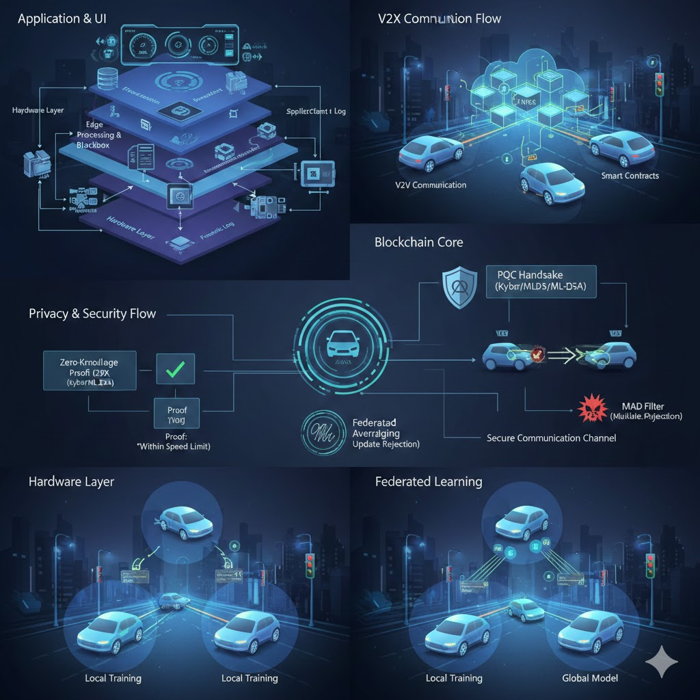

```text
Smart Car - Blockchain for Vehicle Security/
|-- main.py
|-- dashboard.py
|-- blockchain.py
|-- blockchain.cpp
|-- blockchain.h
|-- zkp_privacy.py
|-- v2x_protocol.py
|-- sync_protocol.py
|-- did_identity.py
|-- smart_contracts.py
|-- edge_layer.py
|-- anomaly_detector.py
|-- federated_learning.py
|-- vehicle_sensors.py
|-- hardware_bridge.py
|-- pi_sensor_node.py
|-- network_overhead_analysis.py
|-- fl_trainer_node.py
|-- decentralized_fl_demo.py
|-- readme.md
|-- requirements.txt
|-- .env
|-- logs/
|-- image_source/
|   |-- project_theam.jpg
|   |-- System-Architechture.png
|   |-- privacy-security-flow.png
|   |-- commonication-blockchain-synctrization.png
|   |-- federaated-learning-flow.png
|   |-- Zero-Knowladge-proofs.png
|   |-- Large-language-model.png
|   `-- road_scene.svg
`-- build/
```

## 4. Production-Oriented ZKP Parameters

Key parameters from `.env`:
- `SMARTCAR_ZKP_PARAM_SET`
- `SMARTCAR_ZKP_P`, `SMARTCAR_ZKP_G`, `SMARTCAR_ZKP_H`


```math
\begin{aligned}
C&=(G^{value\bmod Q}\cdot H^r)\bmod P\\
ch&=H(commitment\parallel t\parallel context)\bmod Q
\end{aligned}
```

- First formula creates the Pedersen-style commitment used to hide sensitive value.
- Second formula creates Fiat-Shamir challenge for non-interactive knowledge proof verification.

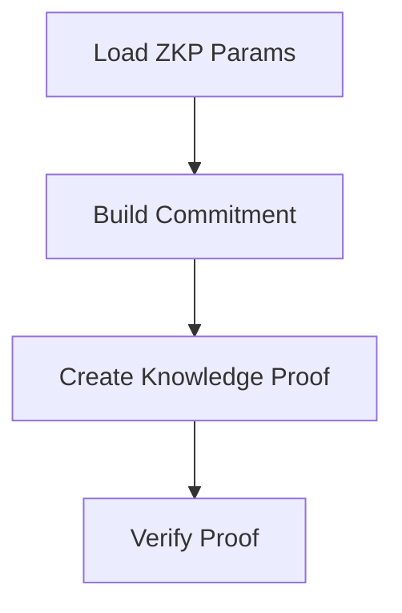
```mermaid
flowchart TD
    A[Load ZKP Params] --> B[Build Commitment]
    B --> C[Create Knowledge Proof]
    C --> D[Verify Proof]
```

## 5. Network Error Handling Hardening

Scope:
- Timeout retry loops
- Broken pipe and reset handling
- Safe send and safe shutdown paths

(reliability metric used operationally):
```math
success_{rate}=\frac{successful_{messages}}{total_{messages}}\times 100
```

- Measures delivery reliability of sync/V2X pipeline under hardened retry and exception handling.

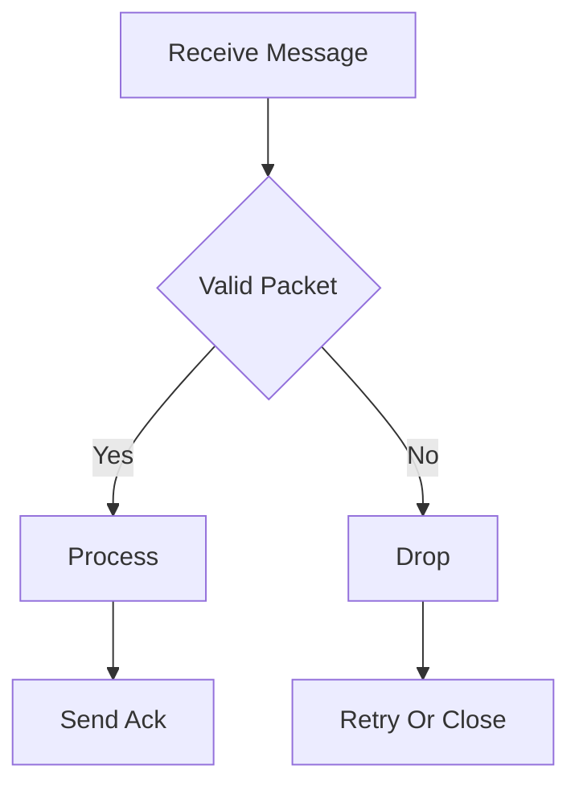
```mermaid
flowchart TD
    A[Receive Message] --> B{Valid Packet}
    B -->|Yes| C[Process]
    B -->|No| D[Drop]
    C --> E[Send Ack]
    D --> F[Retry Or Close]
```

## 6. Quantum-Resistant V2V Handshake (Dynamic PQC)

Crypto agility and handshake:
- PQC KEM preferred (`ML-KEM` or `Kyber`)
- Classical fallback (`ECDH + HKDF`)
- Dynamic `SHA3` vs `DILITHIUM` mode switching


```math
\begin{aligned}
score&=w_L\cdot latency_{component}+w_T\cdot traffic_{component}\\
latency_{component}&=\min\left(1,\frac{avg_{rtt}}{latency_{high}}\right)\\
traffic_{component}&=\min\left(1,\frac{mps}{traffic_{high}}\right)
\end{aligned}
```

- Converts current network condition into a bounded agility score.
- Score drives dynamic crypto mode switch between `DILITHIUM` and `SHA3` with hysteresis.

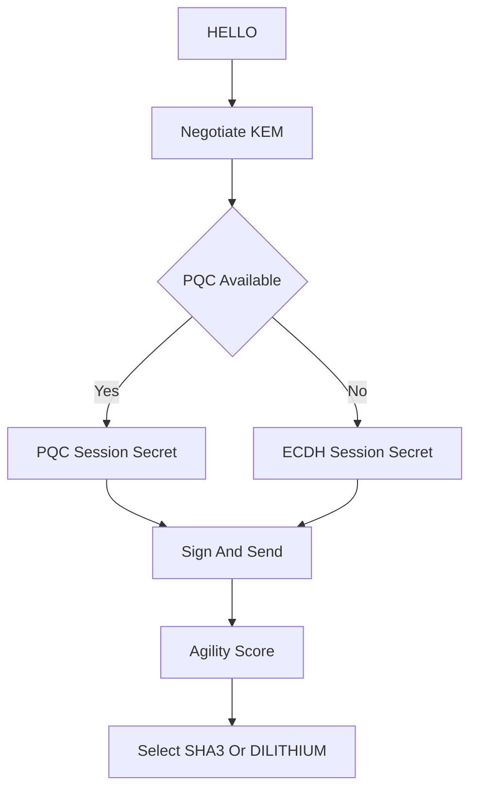
```mermaid
flowchart TD
    A[HELLO] --> B[Negotiate KEM]
    B --> C{PQC Available}
    C -->|Yes| D[PQC Session Secret]
    C -->|No| E[ECDH Session Secret]
    D --> F[Sign And Send]
    E --> F
    F --> G[Agility Score]
    G --> H[Select SHA3 Or DILITHIUM]
```

## 7. Local Storage Encryption (Blockchain File)

Storage modes:
- `AES-256-GCM` primary
- PBKDF2 based authenticated envelope fallback


```math
\begin{aligned}
K&=PBKDF2\text{-}HMAC\text{-}SHA256(passphrase,salt,iterations)\\
ciphertext&=AES\text{-}256\text{-}GCM(K,nonce,plaintext,aad)
\end{aligned}
```

- Derives storage encryption key from passphrase.
- Encrypts blockchain file payload with authenticated encryption to prevent tamper and leak.

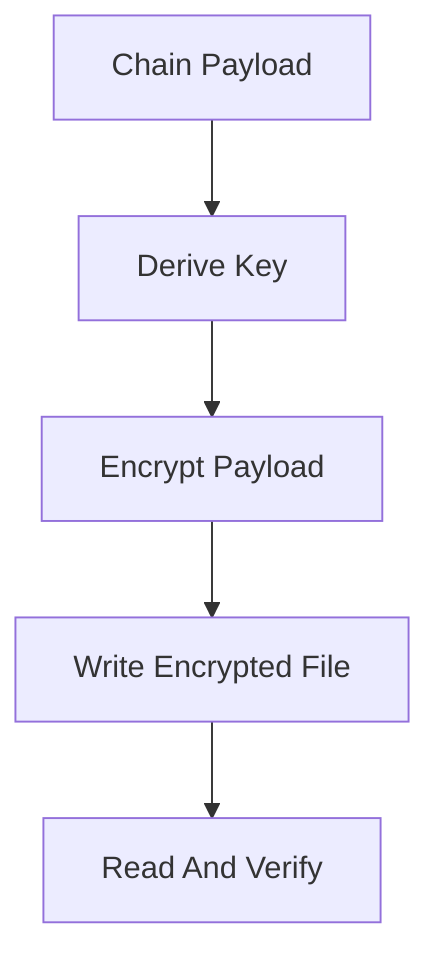
```mermaid
flowchart TD
    A[Chain Payload] --> B[Derive Key]
    B --> C[Encrypt Payload]
    C --> D[Write Encrypted File]
    D --> E[Read And Verify]
```

## 8. Encrypted Blackbox Logging (Forensic Analysis)

Flow:
- Rolling window capture
- Triggered forensic lock package
- Separate wrapped keys for forensic and insurance
- Inject forensic block to chain


```math
\begin{aligned}
window_{samples}&=sample_{hz}\times window_{sec}\\
forensic_{trigger\_score}&=impact_{flag}+hack_{flag}+emergency_{flag}
\end{aligned}
```

- First formula sets how many raw records stay in rolling forensic window.
- Second formula represents trigger logic for generating locked forensic package block.

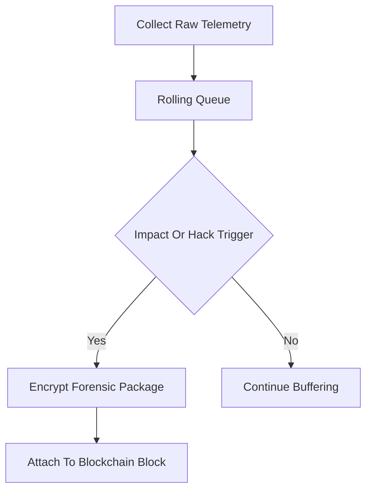
```mermaid
flowchart TD
    A[Collect Raw Telemetry] --> B[Rolling Queue]
    B --> C{Impact Or Hack Trigger}
    C -->|Yes| D[Encrypt Forensic Package]
    D --> E[Attach To Blockchain Block]
    C -->|No| F[Continue Buffering]
```

## 9. Multi-Modal Biometric Auth via Blockchain

Fields:
- `driver_heart_rate_bpm`
- `driver_drowsiness_score`
- `driver_unwell`


```math
\begin{aligned}
biometric_{hash}&=SHA3\text{-}256(hr\parallel drowsiness\parallel unwell_{flag})\\
risk_{flag}&=(hr\le hr_{low})\lor(hr\ge hr_{high})\lor(drowsiness\ge threshold)\lor unwell
\end{aligned}
```

- Hash formula creates immutable biometric digest included in each block.
- Risk formula decides whether safe-mode contract action should be triggered.

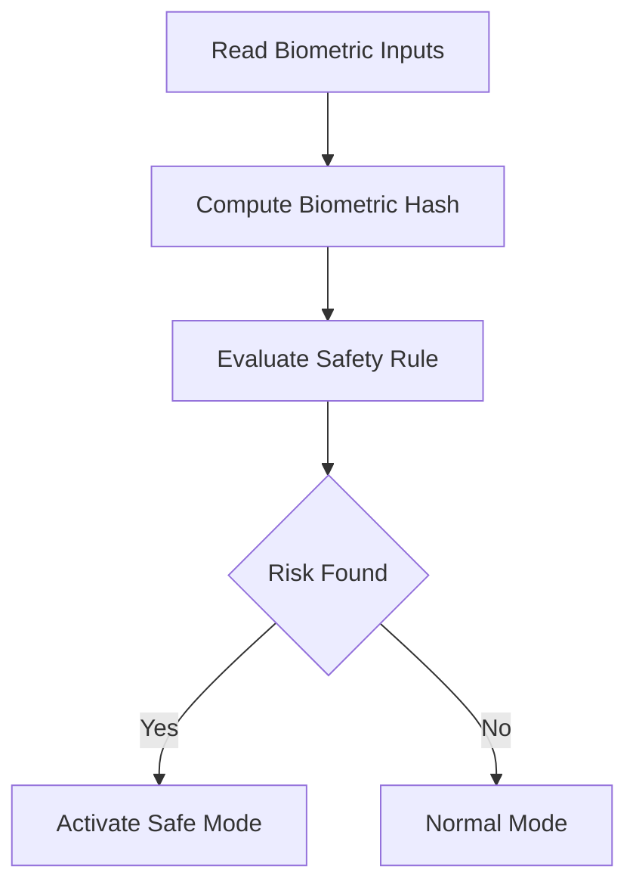
```mermaid
flowchart TD
    A[Read Biometric Inputs] --> B[Compute Biometric Hash]
    B --> C[Evaluate Safety Rule]
    C --> D{Risk Found}
    D -->|Yes| E[Activate Safe Mode]
    D -->|No| F[Normal Mode]
```

## 10. Decentralized AI-Model Training (Federated Learning)

Training shape:
- Local logistic training on each vehicle
- Share only weight deltas
- Robust aggregation + outlier defense + DP noise


```math
\begin{aligned}
\hat{y}&=\sigma(Xw),\quad \sigma(x)=\frac{1}{1+e^{-x}}\\
\nabla_w&=\frac{X^T(\hat{y}-y)}{n},\quad w\leftarrow w-\eta\nabla_w\\
\Delta'&=
\begin{cases}
\Delta, & \|\Delta\|_2\le c \\
\Delta\cdot\frac{c}{\|\Delta\|_2}, & \|\Delta\|_2>c
\end{cases}
\end{aligned}
```

- First formula is logistic prediction used by local obstacle-risk model.
- Second formula is SGD update rule for local training.
- Third formula is norm clipping to defend against poisoned/extreme client updates.

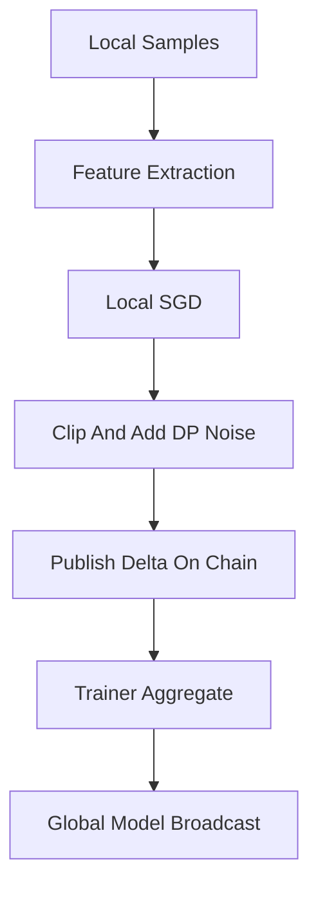
```mermaid
flowchart TD
    A[Local Samples] --> B[Feature Extraction]
    B --> C[Local SGD]
    C --> D[Clip And Add DP Noise]
    D --> E[Publish Delta On Chain]
    E --> F[Trainer Aggregate]
    F --> G[Global Model Broadcast]
```

## 11. Self-Healing Blockchain (Pruning + Sharding)

Core behavior:
- Archive old blocks into shards
- Keep root hash and anchor metadata on-chain
- Build and verify cross-shard proof
- Checkpoint state snapshots


```math
\begin{aligned}
leaf_i&=SHA3\text{-}256(index\parallel block_{hash}\parallel telemetry_{hash}\parallel event_{hash}\parallel previous_{hash})\\
root&=Merkle(leaf_1,leaf_2,\dots,leaf_n)
\end{aligned}
```

- Leaf hash encodes each archived block into tamper-evident shard element.
- Merkle root anchors entire shard compactly on-chain for later proof verification.

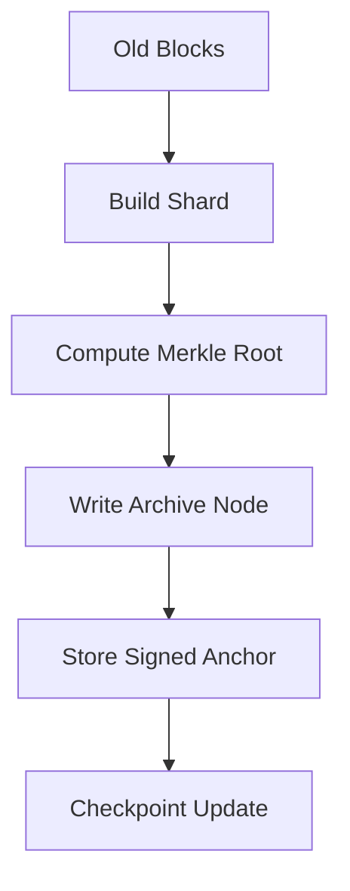
```mermaid
flowchart TD
    A[Old Blocks] --> B[Build Shard]
    B --> C[Compute Merkle Root]
    C --> D[Write Archive Node]
    D --> E[Store Signed Anchor]
    E --> F[Checkpoint Update]
```

## 12. Platooning Security with Proof-of-Proximity (PoP)

PoP rule:
- Own distance must be in range
- Neighbor confirmations must pass confidence threshold
- Approval bound to proof hash in block metadata


```math
\begin{aligned}
own_{valid}&=(d_{own}\in[d_{min},d_{max}])\\
participants&=(1\text{ if }own_{valid}\text{ else }0)+N_{selected}\\
approved&=own_{valid}\land(participants\ge required_{participants})
\end{aligned}
```

- Own-valid checks physical range condition for platoon safety.
- Participants counts own vehicle plus trusted nearby confirmations.
- Approved defines final PoP consensus rule for block acceptance.

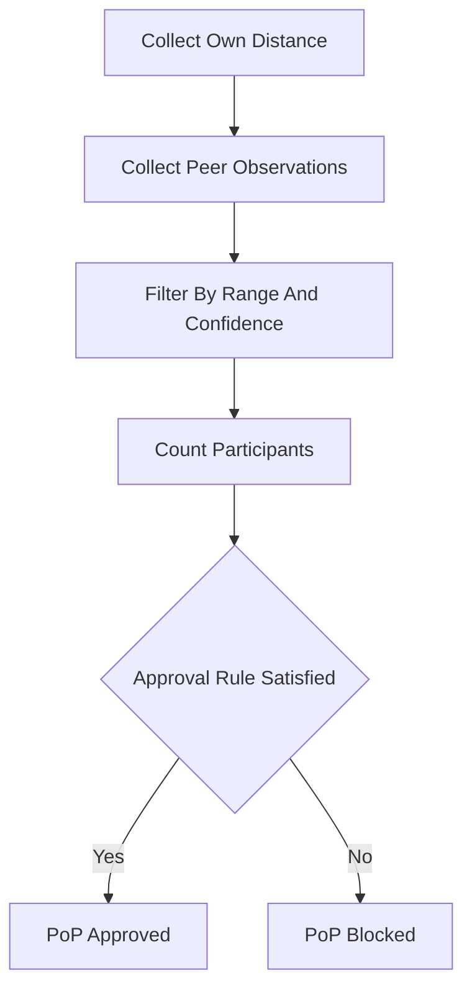
```mermaid
flowchart TD
    A[Collect Own Distance] --> B[Collect Peer Observations]
    B --> C[Filter By Range And Confidence]
    C --> D[Count Participants]
    D --> E{Approval Rule Satisfied}
    E -->|Yes| F[PoP Approved]
    E -->|No| G[PoP Blocked]
```

## 13. Owner Recovery Mode

Flow:
- Validate recovery key hash
- If chain valid then unlock
- If compromised and policy allows, force reset to genesis


```math
\begin{aligned}
provided_{hash}&=SHA3\text{-}256(recovery_{key})\\
valid_{key}&\iff provided_{hash}=stored_{owner\_recovery\_hash}
\end{aligned}
```

- Recovery key is never compared in plaintext, only by hash equality.
- Valid hash unlocks owner recovery flow and optional controlled chain reset path.

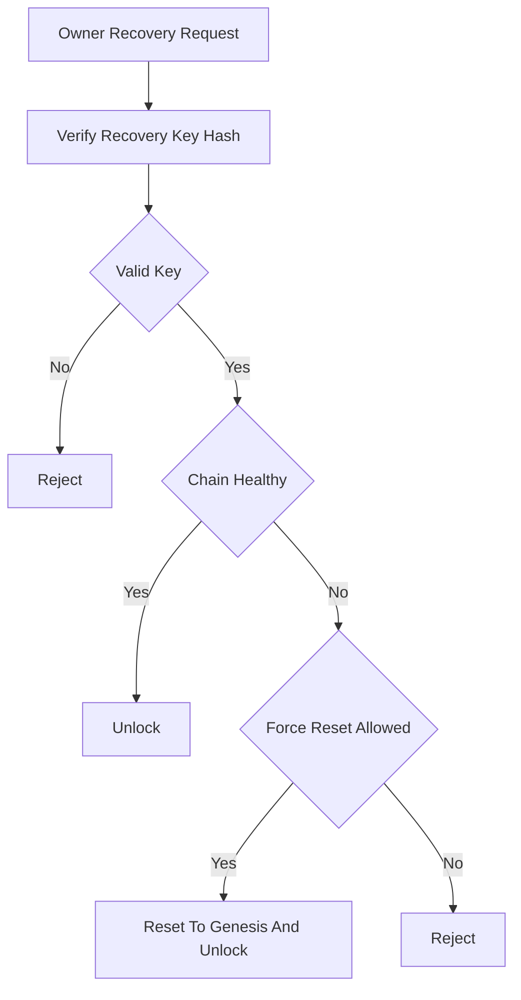
```mermaid
flowchart TD
    A[Owner Recovery Request] --> B[Verify Recovery Key Hash]
    B --> C{Valid Key}
    C -->|No| D[Reject]
    C -->|Yes| E{Chain Healthy}
    E -->|Yes| F[Unlock]
    E -->|No| G{Force Reset Allowed}
    G -->|Yes| H[Reset To Genesis And Unlock]
    G -->|No| I[Reject]
```

## 14. Function-wise Math and Mermaid


### `blockchain.py`

#### `dual_hash(data)`

```text
sha2 = SHA2-256(data)
sha3 = SHA3-256(data)
combined = SHA2-256(data + sha3)
```

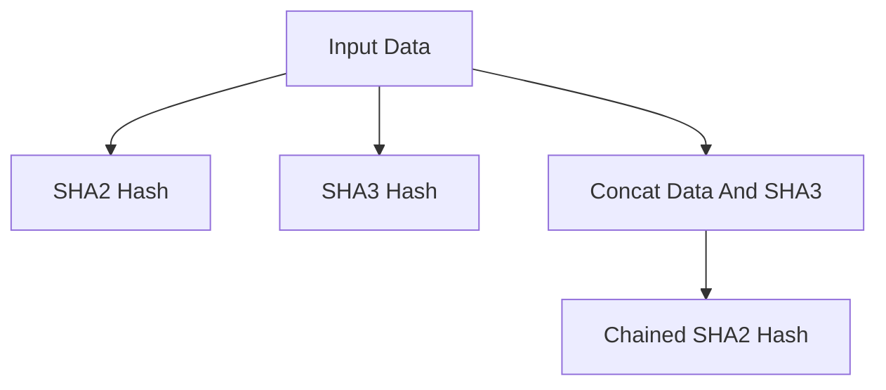
```mermaid
flowchart TD
    A[Input Data] --> B[SHA2 Hash]
    A --> C[SHA3 Hash]
    A --> D[Concat Data And SHA3]
    D --> E[Chained SHA2 Hash]
```

#### `compute_block_hash(...)`

```text
raw = index || timestamp || vehicle_id || telemetry_hash_sha3 || event_hash_sha3 || previous_hash
block_hash = SHA3-256(raw)
```

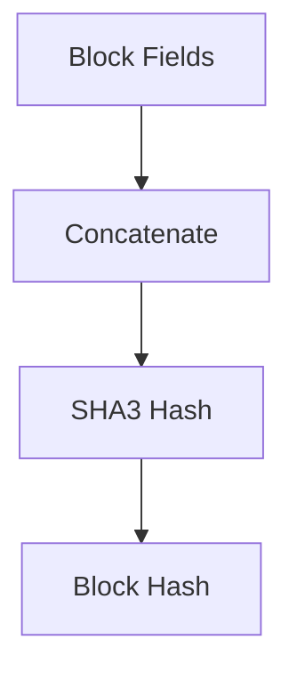
```mermaid
flowchart TD
    A[Block Fields] --> B[Concatenate]
    B --> C[SHA3 Hash]
    C --> D[Block Hash]
```

#### `poa_sign_block(...)`

```text
payload = block_hash || "|" || validator_id || "|" || authority_round
poa_signature = HMAC-SHA256(validator_key, payload)
```

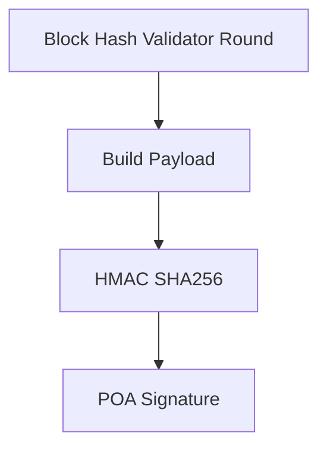
```mermaid
flowchart TD
    A[Block Hash Validator Round] --> B[Build Payload]
    B --> C[HMAC SHA256]
    C --> D[POA Signature]
```

#### `Block.compute_hashes(...)`

```text
telemetry_hash_sha2 = SHA2-256(telemetry_string)
telemetry_hash_sha3 = SHA3-256(telemetry_string)
event_hash_sha2 = SHA2-256(event_data)
event_hash_sha3 = SHA3-256(event_data)
dual_hash_combined = SHA2-256(block_hash) || ":" || SHA3-256(block_hash)
biometric_hash_sha3 = SHA3-256(heart_rate|drowsiness|unwell_flag)
```

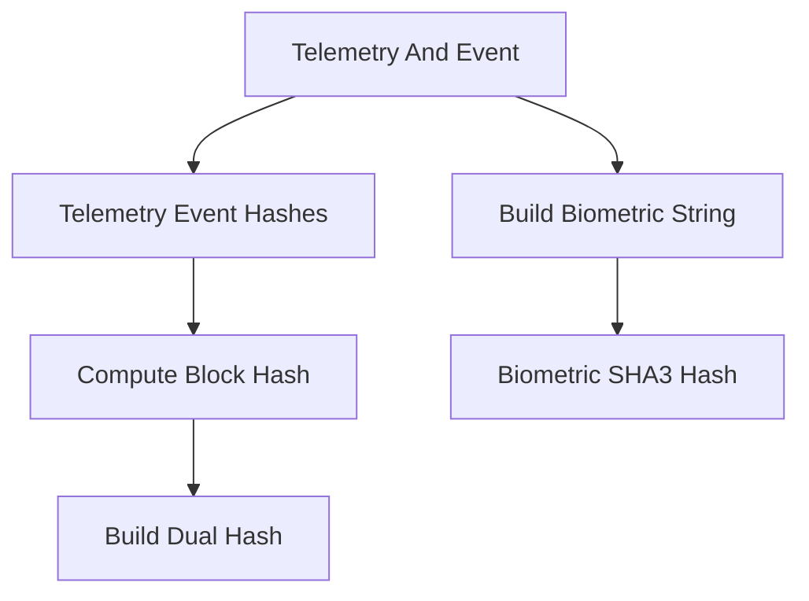
```mermaid
flowchart TD
    A[Telemetry And Event] --> B[Telemetry Event Hashes]
    B --> C[Compute Block Hash]
    C --> D[Build Dual Hash]
    A --> E[Build Biometric String]
    E --> F[Biometric SHA3 Hash]
```

#### `SmartCarCrypto.encrypt(plaintext)`

```text
key = PBKDF2-HMAC-SHA256(password, salt, 100000, 64 bytes)
ciphertext = plaintext XOR keystream
mac = HMAC-SHA256(mac_key, nonce || ciphertext)
package = base64(nonce || mac || ciphertext)
```

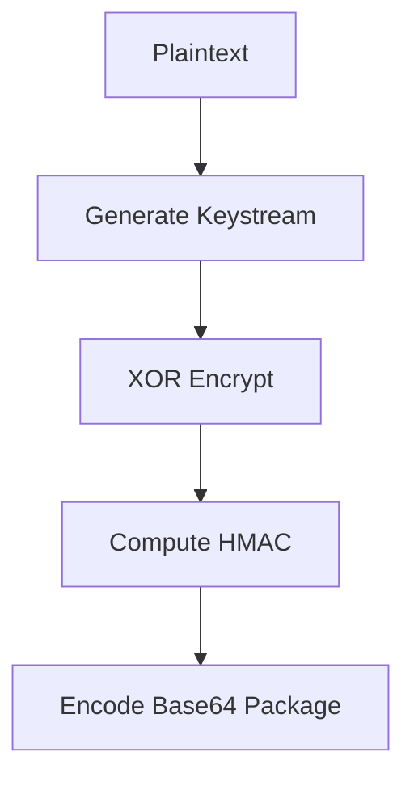
```mermaid
flowchart TD
    A[Plaintext] --> B[Generate Keystream]
    B --> C[XOR Encrypt]
    C --> D[Compute HMAC]
    D --> E[Encode Base64 Package]
```

#### `SmartCarCrypto.decrypt(encrypted_b64)`

```text
expected_mac = HMAC-SHA256(mac_key, nonce || ciphertext)
if mac != expected_mac => reject
plaintext = ciphertext XOR keystream
```

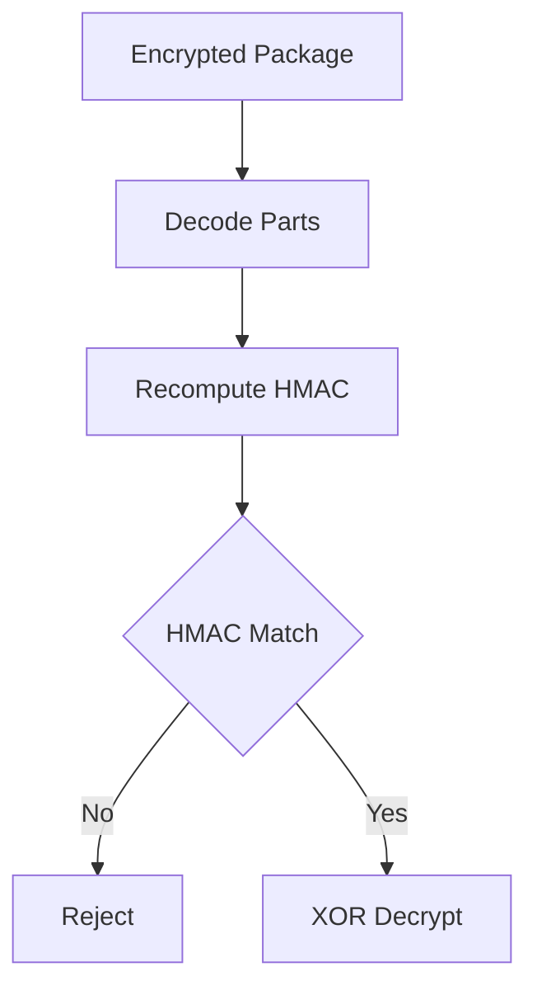
```mermaid
flowchart TD
    A[Encrypted Package] --> B[Decode Parts]
    B --> C[Recompute HMAC]
    C --> D{HMAC Match}
    D -->|No| E[Reject]
    D -->|Yes| F[XOR Decrypt]
```

### `zkp_privacy.py`

#### `commit(value, blind)`

```text
C = (G^(value mod Q) * H^r) mod P
```

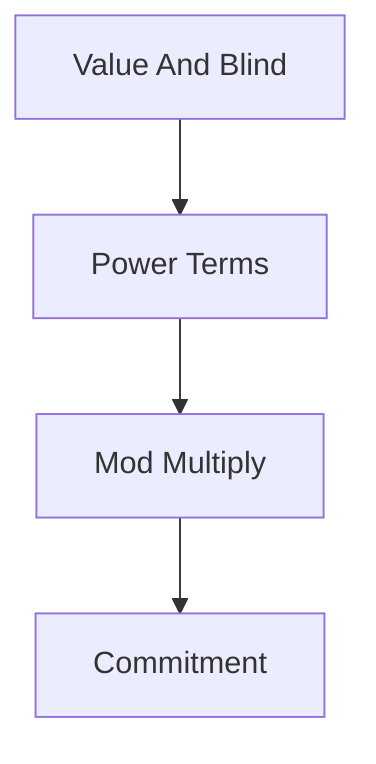
```mermaid
flowchart TD
    A[Value And Blind] --> B[Power Terms]
    B --> C[Mod Multiply]
    C --> D[Commitment]
```

#### `prove_knowledge(...)`

```text
t  = (G^k1 * H^k2) mod P
ch = H(commitment|t|context) mod Q
s1 = (k1 + ch*value) mod Q
s2 = (k2 + ch*blind) mod Q
```

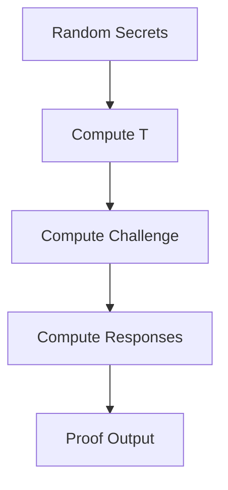
```mermaid
flowchart TD
    A[Random Secrets] --> B[Compute T]
    B --> C[Compute Challenge]
    C --> D[Compute Responses]
    D --> E[Proof Output]
```

#### `verify_knowledge(...)`

```text
lhs = (G^s1 * H^s2) mod P
rhs = (t * commitment^ch) mod P
valid = (lhs == rhs)
```

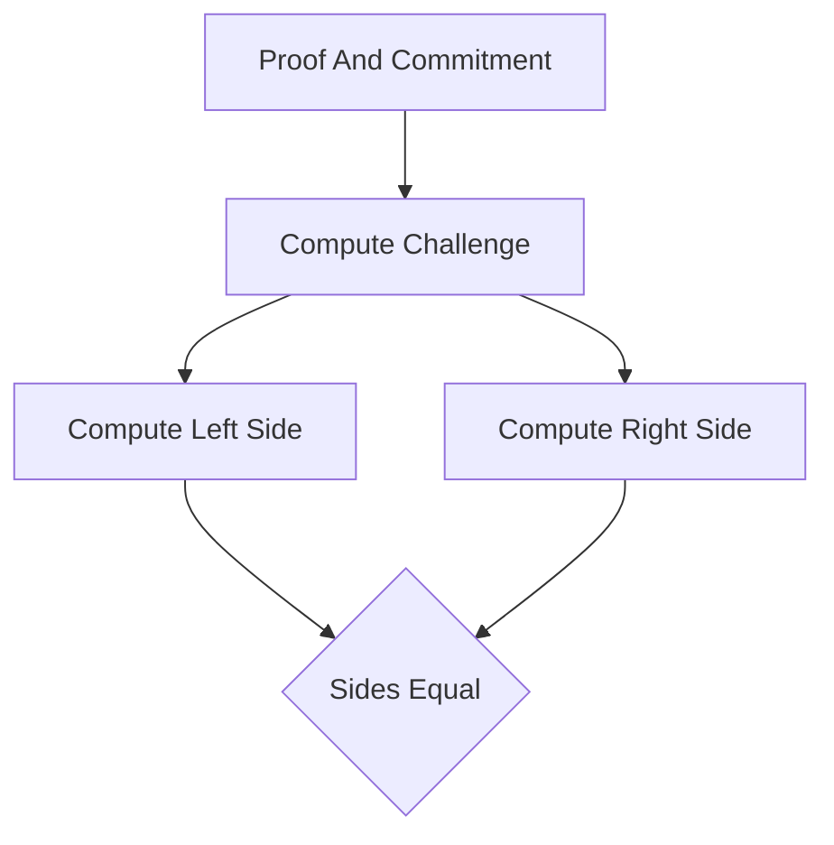
```mermaid
flowchart TD
    A[Proof And Commitment] --> B[Compute Challenge]
    B --> C[Compute Left Side]
    B --> D[Compute Right Side]
    C --> E{Sides Equal}
    D --> E
```

#### `create_speed_limit_proof(...)`

```text
speed = round(speed_kmh), speed >= 0
diff = limit - speed
relation_blind = (r_speed + r_diff) mod Q
```

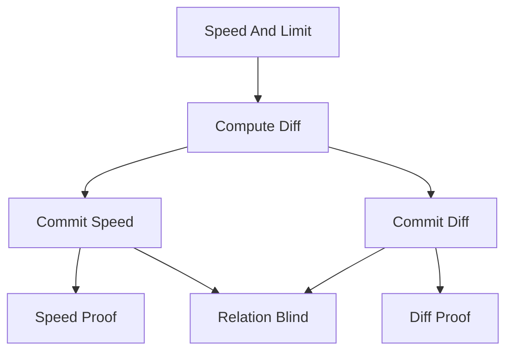
```mermaid
flowchart TD
    A[Speed And Limit] --> B[Compute Diff]
    B --> C[Commit Speed]
    B --> D[Commit Diff]
    C --> E[Speed Proof]
    D --> F[Diff Proof]
    C --> G[Relation Blind]
    D --> G
```

#### `verify_speed_limit_proof(...)`

```text
lhs = (commit_speed * commit_diff) mod P
rhs = (G^limit * H^relation_blind) mod P
valid = proof_speed_ok AND proof_diff_ok AND (lhs == rhs)
```

```mermaid
flowchart TD
    A[Proof Object] --> B[Verify Speed Proof]
    A --> C[Verify Diff Proof]
    A --> D[Verify Relation]
    B --> E{All Valid}
    C --> E
    D --> E
```

### `anomaly_detector.py`

#### `_mean_std(key)`

```text
mean = sum(vals)/n
var  = sum((v-mean)^2)/(n-1)
std  = sqrt(var)
```

```mermaid
flowchart TD
    A[History Values] --> B[Mean]
    B --> C[Variance]
    C --> D[Standard Deviation]
```

#### `detect_telemetry(telemetry)`

```text
z = |(x-mean)/std|
zsum = z_speed + z_accel + z_temp + z_rpm
score += zsum/4 + rule_based_penalties
is_anomaly = (score >= threshold) OR (reason_count >= 2)
```

```mermaid
flowchart TD
    A[Input Telemetry] --> B[Rule Penalties]
    A --> C[Z Score Features]
    B --> D[Total Score]
    C --> D
    D --> E{Anomaly Decision}
```

### `edge_layer.py`

#### `_avg(vals)`

```text
avg = sum(vals)/len(vals)
```

```mermaid
flowchart TD
    A[Value List] --> B[Sum Values]
    A --> C[Count Values]
    B --> D[Divide]
    C --> D
```

#### `_flush(event_hint)`

```text
speed      = avg(speed_vals)
obstacle   = min(obs_vals)
brake      = max(brake_vals)
drowsiness = max(drowsy_vals)
```

```mermaid
flowchart TD
    A[Buffered Telemetry] --> B[Extract Vectors]
    B --> C[Average Metrics]
    B --> D[Minimum Metrics]
    B --> E[Maximum Metrics]
    C --> F[Summary Output]
    D --> F
    E --> F
```

### `vehicle_sensors.py`

#### `GPSSimulator.update(speed_kmh, heading_change)`

```text
speed_ms = speed_kmh / 3.6
d = speed_ms * dt / 111111
lat += d * cos(heading_rad)
lon += d * sin(heading_rad)
```

```mermaid
flowchart TD
    A[Speed Heading] --> B[Convert To Meter Per Second]
    B --> C[Compute Angular Distance]
    C --> D[Update Latitude]
    C --> E[Update Longitude]
```

#### `EngineSimulator.update(throttle, dt)`

```text
target_rpm = 800 + (throttle/100)*6200
rpm += (target_rpm - rpm)*0.1
fuel -= (0.00001 + throttle*0.000005)*dt
oil_pressure = 3.5 + (rpm/6000)*1.5 + noise
```

```mermaid
flowchart TD
    A[Throttle And Delta Time] --> B[Target RPM]
    B --> C[Smooth RPM]
    A --> D[Fuel Consumption]
    C --> E[Oil Pressure]
```

#### `EmergencyBrakeController._on_obstacle_detected(obstacle)`

```text
if distance < 30m: brake_pressure = 100
else brake_pressure = (1 - distance/100)*100
```

```mermaid
flowchart TD
    A[Obstacle Distance] --> B{Emergency Zone}
    B -->|No| C[No Brake]
    B -->|Yes| D{Critical Zone}
    D -->|Yes| E[Full Brake]
    D -->|No| F[Linear Brake]
```

### `dashboard.py`

#### `_estimate_distance(box_h)`

```text
distance_m = (1.70 * 850.0) / box_h
```

```mermaid
flowchart TD
    A[Bounding Box Height] --> B[Distance Formula]
    B --> C[Estimated Meter]
```

#### `_draw_speedometer()`

```text
angle_deg = 162 - (speed/220)*144
needle_x = cx + (r-30)*cos(angle)
needle_y = cy - (r-30)*sin(angle)
```

```mermaid
flowchart TD
    A[Current Speed] --> B[Clamp Speed]
    B --> C[Compute Needle Angle]
    C --> D[Compute Cos And Sin]
    D --> E[Needle Position]
```

#### `_update_model()`

```text
target_speed = throttle * 1.6
speed += (target_speed - speed) * 0.12
rpm = 900 + speed * 36
odometer += (speed / 3600) * 0.08
risk = 0.01 + emergency_term + detection_term + obstacle_term + overspeed_term + noise
```

```mermaid
flowchart TD
    A[Throttle And Current State] --> B[Update Speed]
    B --> C[Update RPM Temp Fuel Odometer]
    C --> D[Compute Risk Score]
    D --> E[Append Anomaly History]
```

### `federated_learning.py`

#### `_sigmoid(x)`

```text
sigmoid(x) = 1 / (1 + exp(-clip(x,-40,40)))
```

```mermaid
flowchart TD
    A[Input Vector] --> B[Clip Input]
    B --> C[Exponential]
    C --> D[Sigmoid Output]
```

#### `FederatedObstacleLearner._extract_features(telemetry)`

```text
speed_norm = clip(speed/180, 0, 1)
accel_norm = clip(|accel|/12, 0, 1)
brake_norm = clip(brake/100, 0, 1)
temp_norm  = clip((temp-60)/60, 0, 1)
near_obstacle = 1 if distance<=35 else 0
hr_risk = 1 if hr<=45 or hr>=140 else 0
```

```mermaid
flowchart TD
    A[Telemetry] --> B[Normalize Continuous Features]
    A --> C[Compute Threshold Features]
    B --> D[Feature Vector]
    C --> D
```

#### `FederatedObstacleLearner._train_batch(x,y,epochs)`

```text
logits = Xw
pred = sigmoid(logits)
grad = X^T(pred - y)/n
w = w - lr*grad
loss = -mean(y*log(pred)+(1-y)*log(1-pred))
```

```mermaid
flowchart TD
    A[Input Batch] --> B[Forward Pass]
    B --> C[Gradient]
    C --> D[Weight Update]
    D --> E[Loss Value]
```

#### `FederatedObstacleLearner._clip_delta(delta, clip_norm)`

```text
n = ||delta||2
if n > c: delta = delta * (c/n)
```

```mermaid
flowchart TD
    A[Delta Vector] --> B[Norm]
    B --> C{Above Clip}
    C -->|Yes| D[Scale Delta]
    C -->|No| E[Keep Delta]
```

#### `FederatedTrainer._mad_filter(vals,k)`

```text
med = median(vals)
mad = median(|vals - med|) + 1e-9
z = |vals - med| / mad
keep = z <= k
```

```mermaid
flowchart TD
    A[Norm Values] --> B[Median]
    B --> C[MAD]
    C --> D[Robust Score]
    D --> E[Keep Mask]
```

#### `FederatedTrainer._robust_weighted_trimmed_mean(...)`

```text
sort each feature column
trim lowest/highest ratio
output_j = sum(col_j * weight_j)/sum(weight_j)
```

```mermaid
flowchart TD
    A[Client Deltas And Weights] --> B[Sort Per Feature]
    B --> C[Trim Tails]
    C --> D[Weighted Mean]
    D --> E[Aggregated Delta]
```

### `v2x_protocol.py`

#### `DynamicCryptoAgilityLayer._agility_score(recommended_mode)`

```text
avg_rtt = mean(rtt_history)
mps = msg_count / window_sec
latency_component = min(1, avg_rtt/latency_hi_ms)
traffic_component = min(1, mps/traffic_hi_mps)
score = wL*latency_component + wT*traffic_component
```

```mermaid
flowchart TD
    A[RTT History] --> B[Latency Component]
    C[Message History] --> D[Traffic Component]
    B --> E[Weighted Score]
    D --> E
```

#### `DynamicCryptoAgilityLayer.maybe_switch_mode(...)`

```text
if mode=DILITHIUM and score>=up_thr -> target=SHA3
if mode=SHA3 and score<=down_thr -> target=DILITHIUM
switch only after confirm_count and switch_interval_sec
```

```mermaid
flowchart TD
    A[Current Mode And Score] --> B[Target Mode]
    B --> C[Confirmation Counter]
    C --> D{Ready To Switch}
    D -->|Yes| E[Switch Mode]
    D -->|No| F[Keep Mode]
```

#### `V2XHub._recommend_crypto_mode()`

```text
score = 0.5*traffic_ratio + 0.3*client_load_ratio + 0.2*latency_ratio
mode = SHA3 if score>=0.66 else DILITHIUM
```

```mermaid
flowchart TD
    A[Messages Per Second] --> B[Traffic Ratio]
    C[Client Count] --> D[Load Ratio]
    E[Latency Hint] --> F[Latency Ratio]
    B --> G[Weighted Score]
    D --> G
    F --> G
    G --> H[Choose Crypto Mode]
```

### `network_overhead_analysis.py`

#### `analyze()`

```text
overhead_pct = ((protocol_bytes - plain_bytes) / plain_bytes) * 100
```

Applied for:
- `protocol_no_mac_bytes`
- `protocol_hmac_bytes`
- `encrypted_hmac_bytes`

```mermaid
flowchart TD
    A[Plain Bytes] --> B[Protocol Bytes]
    B --> C[Subtract]
    A --> D[Divide]
    C --> D
    D --> E[Multiply By Hundred]
```

### `did_identity.py`

#### `_msg_bits(message)`

```text
digest = SHA3-256(message)
bits[i] = (byte >> shift) & 1
```

```mermaid
flowchart TD
    A[Message] --> B[SHA3 Digest Bytes]
    B --> C[Bit Extraction]
    C --> D[Bit Vector]
```

#### `verify_did_proof(challenge, proof, did_document)`

```text
challenge_hash == SHA3-256(challenge)
for each i: SHA3(signature[i]) == public_pairs[i][bit_i]
```

```mermaid
flowchart TD
    A[Challenge Proof Document] --> B[Challenge Hash Check]
    B --> C[Lamport Verify Loop]
    C --> D{All Matched}
```


#### `blockchain.py::LocalStorageCipher.encrypt_payload(payload)`

```text
key = PBKDF2-HMAC-SHA256(passphrase, salt, iterations, 32 bytes)
ciphertext = AES-256-GCM(key, nonce, plaintext, aad)
```

#### `blockchain.py::_archive_shard_root(blocks)`

```text
leaf_i = SHA3-256(index|block_hash|telemetry_hash|event_hash|previous_hash)
parent = SHA3-256(left || right)
repeat until single root hash
```

#### `blockchain.py::_build_merkle_proof(...)` and `_verify_merkle_proof(...)`

```text
proof step = {position, sibling_hash}
verify by iterative hashing from leaf to root
```

#### `blockchain.py::_evaluate_pop_consensus(...)`

```text
own_valid = min_dist <= own_distance <= max_dist
participants = (1 if own_valid else 0) + selected_neighbor_count
approved = own_valid AND participants >= required_participants
```

#### `dashboard.py::_refresh_v2x_nodes()`

```text
ang  = (now * (0.6 + i*0.08) + i*0.9) mod (2*pi)
dist = 0.2 + ((sin(now*0.3 + i) + 1) * 0.35)
```


## 15. Full System Chain Connect Mermaid
```mermaid
flowchart LR
    S1[Vehicle Sensors] --> S2[Edge Layer]
    S2 --> S3[Anomaly Detector]
    S2 --> S4[ZKP Privacy]
    S3 --> S5[Blockchain Core]
    S4 --> S5
    S5 --> S6[Smart Contracts]
    S5 --> S7[Forensic Blackbox]
    S5 --> S8[Federated Learning]
    S5 --> S9[Pruning And Sharding]
    S5 --> S10[PoP Validation]
    S5 --> S11[DID Verification]
    S5 --> S12[Encrypted Local Storage]
    S5 --> S13[V2X Protocol]
    S13 --> S14[V2X Hub And Peer Nodes]
    S5 --> S15[Dashboard UI]
    S15 --> S16[Owner Recovery And Control]
```

## 16. Full System Description
OmniGuard V2X is a full-stack smart-vehicle security platform where telemetry enters through sensor and hardware interfaces, gets filtered and summarized at edge, is validated for anomaly and privacy, and is committed to a PoA-based blockchain with optional PoP constraints. The system keeps dual-hash block integrity, cryptographically signs validation rounds, and stores sensitive state with encryption-at-rest.

On top of core chain integrity, the platform adds forensic blackbox packaging for incident response, biometric risk-aware safe-mode enforcement, DID-based identity checks, and dynamic smart-contract triggers for automated policy actions. In networked operation, nodes communicate through hardened sync and V2X channels that support dynamic cryptographic agility and post-quantum aware handshake paths.

For long-term resilience, self-healing storage applies pruning, sharding, signed shard anchors, and checkpointed trust verification. In parallel, federated learning allows decentralized on-vehicle model improvement while sharing only clipped and protected updates, preserving privacy while improving cooperative safety.

## Run
```bash
python main.py
```

Optional demos:
```bash
python multi_car_majority_demo.py
python v2x_demo_nodes.py
python pqc_kyber_handshake_test.py
python attacker_fake_zkp.py
python zkp_latency_report.py
python network_overhead_analysis.py
python decentralized_fl_demo.py
python fl_trainer_node.py
```
