# OmniGuard V2X: A Privacy-Preserving Blockchain Framework for Smart Vehicle Security
# Developer : Md Shahanur Islam Shagor
# Role      : Project Architect & Lead Developer

SmartCar research platform with blockchain audit trail, PoA consensus, ZKP-based privacy checks, V2X communication, DID, edge processing, anomaly detection, and hardware bridge support.

## Project Layers

1. `Presentation Layer`
- `main.py`, `dashboard.py`
- Live telemetry UI, camera/object detection view, road SVG, speedometer, chain/event panels

2. `Application Layer`
- `blockchain.py`, `smart_contracts.py`, `edge_layer.py`, `anomaly_detector.py`, `did_identity.py`
- Core security logic, smart-contract orchestration, edge summarization, anomaly scoring, DID verification

3. `Network Layer`
- `sync_protocol.py`, `v2x_protocol.py`, `multi_car_majority_demo.py`, `v2x_demo_nodes.py`
- Multi-node sync, majority vote, V2V/V2I exchange, telemetry relay

4. `Privacy/Crypto Layer`
- `zkp_privacy.py`
- Commitment-based lightweight ZKP proofs for speed-limit and location-ownership validation

5. `Hardware/Edge Integration Layer`
- `hardware_bridge.py`, `pi_sensor_node.py`, `SmartCarSensorNode.ino`, `camera_emergency_brake.cpp`
- Arduino/Raspberry Pi input bridge and C++ camera emergency braking pipeline

6. `Observability Layer`
- `perf_metrics.py`, `zkp_latency_report.py`, `network_overhead_analysis.py`, `logs/`
- ZKP latency metrics, network overhead reports/charts, runtime logs

## Folder Structure (Current)

```text
Smart Car - Blockchain for Vehicle Security/
|-- main.py
|-- dashboard.py
|-- blockchain.py
|-- blockchain.cpp
|-- blockchain.h
|-- sync_protocol.py
|-- v2x_protocol.py
|-- zkp_privacy.py
|-- did_identity.py
|-- smart_contracts.py
|-- edge_layer.py
|-- anomaly_detector.py
|-- federated_learning.py
|-- fl_trainer_node.py
|-- vehicle_sensors.py
|-- hardware_bridge.py
|-- pi_sensor_node.py
|-- decentralized_fl_demo.py
|-- network_overhead_analysis.py
|-- multi_car_majority_demo.py
|-- v2x_demo_nodes.py
|-- attacker_fake_zkp.py
|-- perf_metrics.py
|-- zkp_latency_report.py
|-- pqc_kyber_handshake_test.py
|-- SmartCarSensorNode.ino
|-- camera_emergency_brake.cpp
|-- CMakeLists.txt
|-- requirements.txt
|-- .env
|-- readme.md
|-- logs/
|-- build/
|-- image_source/
|   |-- System-Architechture.png
|   |-- privacy-security-flow.png
|   |-- commonication-blockchain-synctrization.png
|   |-- federaated-learning-flow.png
|   |-- Zero-Knowladge-proofs.png
|   |-- Large-language-model.png
|   |-- project_theam.jpg
|   `-- road_scene.svg
`-- __pycache__/
```

## Image Preview (`image_source/`)


## Production-Oriented ZKP Parameters

`zkp_privacy.py` now supports dynamic parameter loading:

- `SMARTCAR_ZKP_PARAM_SET=RFC3526_GROUP14` (default, standard 2048-bit MODP group)
- `SMARTCAR_ZKP_PARAM_SET=MERSENNE_521` (legacy lightweight mode)
- Optional custom override:
  - `SMARTCAR_ZKP_P`
  - `SMARTCAR_ZKP_G`
  - `SMARTCAR_ZKP_H`

All values are read from `.env` at runtime.

## Network Error Handling Hardening

`sync_protocol.py` and `v2x_protocol.py` now include stronger socket exception handling:

- timeout retry flow for receive loops
- explicit handling for disconnect/reset conditions (`BrokenPipeError`, `ConnectionResetError`, `ConnectionAbortedError`)
- guarded send helpers and safer shutdown/cleanup paths

## Quantum-Resistant V2V Handshake (Dynamic PQC)

`v2x_protocol.py` now includes a dynamic cryptographic agility layer:

- handshake exchanges crypto capability (`SHA3`, `DILITHIUM`)
- each node monitors latency/traffic and auto-switches mode
- high latency / high traffic -> lightweight `SHA3` envelope
- normal conditions / quantum-alert mode -> `DILITHIUM` path
- handshake now attempts PQ KEM (`ML-KEM-512` / `Kyber512`) to derive a per-session secret
- if `oqs`/PQC path is unavailable, it automatically falls back to classical `ECDH + HKDF` key exchange and `ECDSA` signatures
- agility switching now uses EWMA-smoothed latency + traffic score with hysteresis (`up/down` thresholds)
- mode switching requires consecutive confirmation decisions to reduce crypto-mode flapping under noisy links

This keeps real-time decision latency stable while still enabling quantum-resistant mode when possible.

Config in `.env`:

- `SMARTCAR_V2X_SHARED_SECRET=...`
- `SMARTCAR_V2X_CRYPTO_DEFAULT=DILITHIUM`
- `SMARTCAR_V2X_CRYPTO_FORCE_MODE=`
- `SMARTCAR_V2X_CRYPTO_SWITCH_INTERVAL_SEC=2.0`
- `SMARTCAR_V2X_CRYPTO_LATENCY_HIGH_MS=120`
- `SMARTCAR_V2X_CRYPTO_TRAFFIC_HIGH_MPS=60`
- `SMARTCAR_V2X_CRYPTO_METRICS_WINDOW_SEC=4.0`
- `SMARTCAR_V2X_CRYPTO_EWMA_ALPHA=0.28`
- `SMARTCAR_V2X_CRYPTO_WEIGHT_LATENCY=0.65`
- `SMARTCAR_V2X_CRYPTO_WEIGHT_TRAFFIC=0.35`
- `SMARTCAR_V2X_CRYPTO_SCORE_UP_THRESHOLD=0.72`
- `SMARTCAR_V2X_CRYPTO_SCORE_DOWN_THRESHOLD=0.54`
- `SMARTCAR_V2X_CRYPTO_REC_BIAS=0.08`
- `SMARTCAR_V2X_CRYPTO_QUANTUM_GUARD_MAX_SCORE=0.90`
- `SMARTCAR_V2X_CRYPTO_SWITCH_CONFIRM_COUNT=2`
- `SMARTCAR_V2X_HUB_LATENCY_HINT_MS=20`
- `SMARTCAR_V2X_QUANTUM_ALERT=0`
- `SMARTCAR_V2X_FORCE_CLASSIC=0`
- `SMARTCAR_V2X_PQC_SIG_ALG=Dilithium2`
- `SMARTCAR_V2X_PQC_KEM_PREFERRED=Kyber512`
- `SMARTCAR_V2X_PQC_KEM_ALGS=ML-KEM-512,Kyber512`

## Local Storage Encryption (Blockchain File)

`blockchain.py` now supports encryption-at-rest for the saved chain file (`logs/blockchain_*.json`):

- Primary mode: `AES-256-GCM` (when `cryptography` is available)
- Fallback mode: authenticated encrypted envelope (`PBKDF2-SHA256-STREAM-HMAC`)

Config in `.env`:

- `SMARTCAR_STORAGE_ENCRYPTION=1`
- `SMARTCAR_STORAGE_PASSPHRASE=` (optional, defaults to `SMARTCAR_PASSWORD`)
- `SMARTCAR_STORAGE_KDF_ITERATIONS=200000`

## Encrypted Blackbox Logging (Forensic Analysis)

If a hacking/security-breach pattern or physical-impact/emergency event is detected, the system now:

1. keeps a rolling last `10 minutes` of raw telemetry/event samples
2. locks that raw timeline in a strong encrypted forensic package
3. writes the locked package into the triggered blockchain block
4. wraps access key material separately for:
   - forensic team
   - insurance company
5. additionally pushes a special `FORENSIC_BLOCK:*` from edge raw queue snapshot on impact

Config in `.env`:

- `SMARTCAR_BLACKBOX_WINDOW_SEC=600`
- `SMARTCAR_BLACKBOX_SAMPLE_HZ=2`
- `SMARTCAR_BLACKBOX_KDF_ITERATIONS=250000`
- `SMARTCAR_FORENSIC_ACCESS_KEY=...`
- `SMARTCAR_INSURANCE_ACCESS_KEY=...`
- `SMARTCAR_EDGE_FORENSIC_QUEUE_SIZE=2400`
- `SMARTCAR_EDGE_FORENSIC_WINDOW_SEC=600`
- `SMARTCAR_FORENSIC_BLOCK_COOLDOWN_SEC=3.0`

## Multi-Modal Biometric Auth via Blockchain

Driver biometric safety signals are now included in each telemetry block:

- `driver_heart_rate_bpm`
- `driver_drowsiness_score`
- `driver_unwell`

The blockchain stores a dedicated biometric digest:

- `biometric_hash_sha3 = SHA3-256(heart_rate | drowsiness | unwell_flag)`

If biometric risk is detected (abnormal heart rate / high drowsiness / unwell flag), a smart contract can auto-trigger vehicle safe mode.

Config in `.env`:

- `BIOMETRIC_SAFETY_CONTRACT_ENABLED=1`
- `BIOMETRIC_HEART_RATE_LOW_BPM=45`
- `BIOMETRIC_HEART_RATE_HIGH_BPM=140`
- `BIOMETRIC_DROWSINESS_THRESHOLD=0.80`

## Decentralized AI-Model Training (Federated Learning)

Cars can now train a lightweight obstacle-risk model locally and share only model `weights_delta` over blockchain.
Raw telemetry is not shared.

Flow:

1. each car ingests local obstacle telemetry
2. local learner creates periodic `FL:MODEL_UPDATE:*` block events
3. peer cars apply remote deltas via aggregation (`FL:AGGREGATE_UPDATE:*`)
4. trainer node can aggregate and also self-train (`train_trainer`) before publishing global weights

Security hardening:

- Weight poisoning defense:
  - client delta norm gate
  - trainer-side MAD outlier filter
  - robust weighted trimmed-mean aggregation
- Differential Privacy:
  - client update delta clipping
  - Gaussian noise on delta before sharing
  - raw telemetry never leaves car

Config in `.env`:

- `SMARTCAR_FL_ENABLED=1`
- `SMARTCAR_FL_UPDATE_INTERVAL_SEC=8.0`
- `SMARTCAR_FL_LEARNING_RATE=0.05`
- `SMARTCAR_FL_LOCAL_EPOCHS=3`
- `SMARTCAR_FL_MIN_SAMPLES=12`
- `SMARTCAR_FL_DP_ENABLED=1`
- `SMARTCAR_FL_DP_NOISE_SIGMA=0.010`
- `SMARTCAR_FL_DELTA_CLIP_NORM=0.25`
- `SMARTCAR_FL_REMOTE_DELTA_MAX_NORM=0.65`
- `SMARTCAR_FL_TRAINER_OUTLIER_MAD_K=3.5`
- `SMARTCAR_FL_TRAINER_TRIM_RATIO=0.20`
- `SMARTCAR_FL_TRAINER_MAX_CLIENT_DELTA_NORM=0.85`

## Self-Healing Blockchain (Pruning + Sharding)

To optimize limited in-vehicle memory, old low-priority blocks are compacted and archived:

1. old blocks are grouped into archive shards
2. shard payload is written to archive-node file
3. shard root-hash is retained on-chain metadata (`archive_root_hash`)
4. archived blocks are compacted in main chain to reduce memory footprint
5. cross-shard verification proof can be generated/verified via Merkle membership + anchored shard root
6. state checkpoint snapshot is generated and signed after prune milestones
7. storage pressure (free MB / free %) can auto-trigger aggressive pruning
8. shard sync bundle exchange allows cars to share signed shard anchors across shards/nodes

Config in `.env`:

- `SMARTCAR_PRUNING_ENABLED=1`
- `SMARTCAR_PRUNE_KEEP_RECENT_BLOCKS=200`
- `SMARTCAR_PRUNE_BATCH_SIZE=50`
- `SMARTCAR_ARCHIVE_NODE_FILE=logs/archive_node.jsonl`
- `SMARTCAR_SHARD_SYNC_ENABLED=1`
- `SMARTCAR_SHARD_SYNC_MAX_ANCHORS=1024`
- `SMARTCAR_SHARD_SYNC_BUNDLE_FILE=logs/shard_sync_bundle_smartcar.json`
- `SMARTCAR_CHECKPOINT_ENABLED=1`
- `SMARTCAR_CHECKPOINT_EVERY_N_SHARDS=1`
- `SMARTCAR_CHECKPOINT_MIN_INTERVAL_SEC=8`
- `SMARTCAR_CHECKPOINT_FILE=logs/state_checkpoint_smartcar.json`
- `SMARTCAR_CHECKPOINT_HISTORY_FILE=logs/state_checkpoint_history_smartcar.jsonl`
- `SMARTCAR_AUTO_STORAGE_MANAGEMENT_ENABLED=1`
- `SMARTCAR_STORAGE_MIN_FREE_MB=512`
- `SMARTCAR_STORAGE_MIN_FREE_PERCENT=8`
- `SMARTCAR_STORAGE_CRITICAL_FREE_MB=256`
- `SMARTCAR_STORAGE_CRITICAL_FREE_PERCENT=4`
- `SMARTCAR_STORAGE_PRUNE_BATCH_MULTIPLIER=2`
- `SMARTCAR_STORAGE_CRITICAL_PRUNE_BATCH_MULTIPLIER=4`

Sharding sync APIs (in `blockchain.py`):

- `export_shard_sync_bundle(max_anchors=128, write_file=True)`
- `import_shard_sync_bundle(bundle, strict_checkpoint=False)`
- `create_cross_shard_proof(shard_id, block_index)`
- `verify_cross_shard_proof(proof_payload)`
- `get_shard_sync_status()`

## Platooning Security with Proof-of-Proximity (PoP)

For platooning scenarios, blockchain approval can be bound to physical LIDAR proximity evidence:

1. nearby vehicles submit proximity observations (`distance_m`, `confidence`)
2. block approval requires distance-in-range + minimum participant confirmations
3. PoP proof hash is stored in block metadata (physical-digital binding)
4. if PoP fails, block is marked as `PLATOON:BLOCKED:POP_FAIL:*`

Config in `.env`:

- `SMARTCAR_PLATOON_POP_ENABLED=1`
- `SMARTCAR_POP_DISTANCE_MIN_M=5`
- `SMARTCAR_POP_DISTANCE_MAX_M=55`
- `SMARTCAR_POP_OBSERVATION_TTL_SEC=1.5`
- `SMARTCAR_POP_REQUIRED_PARTICIPANTS=2`
- `SMARTCAR_POP_MIN_CONFIDENCE=0.80`

### Real Safe-Mode Hardware Dispatch (ECU)

When biometric risk triggers safe mode, `hardware_bridge.py` now dispatches hard-stop command to ECU:

- primary path: CAN frame (extended ID)
- fallback path: serial JSON command to ECU controller

Config in `.env`:

- `SMARTCAR_ECU_CONTROL_ENABLED=1`
- `SMARTCAR_ECU_MODE=can` (or `serial`)
- `SMARTCAR_ECU_CAN_CHANNEL=can0`
- `SMARTCAR_ECU_CAN_BUSTYPE=socketcan`
- `SMARTCAR_ECU_CAN_BITRATE=500000`
- `SMARTCAR_ECU_CAN_ARB_ID=0x18FF50E5`
- `SMARTCAR_ECU_SERIAL_PORT=COM5`
- `SMARTCAR_ECU_SERIAL_BAUD=115200`

## Owner Recovery Mode

If normal auth is blocked due to lockout or chain mismatch:

- Use dashboard `RECOVER` with owner recovery key
- Optional `Force Chain Reset` can rebuild chain from fresh genesis (policy-controlled)

Config in `.env`:

- `SMARTCAR_OWNER_RECOVERY_KEY=...`
- `SMARTCAR_OWNER_ALLOW_CHAIN_RESET=1`

## Function-wise Math Calculation + Mermaid

### `blockchain.py`
Related image: `image_source/System-Architechture.png`, `image_source/commonication-blockchain-synctrization.png`

#### `dual_hash(data)`

```text
sha2 = SHA2-256(data)
sha3 = SHA3-256(data)
combined = SHA2-256(data + sha3)
```

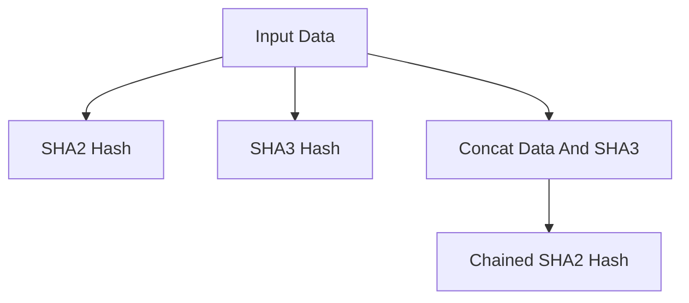
```mermaid
flowchart TD
    A[Input Data] --> B[SHA2 Hash]
    A --> C[SHA3 Hash]
    A --> D[Concat Data And SHA3]
    D --> E[Chained SHA2 Hash]
```

#### `compute_block_hash(...)`

```text
raw = index || timestamp || vehicle_id || telemetry_hash_sha3 || event_hash_sha3 || previous_hash
block_hash = SHA3-256(raw)
```

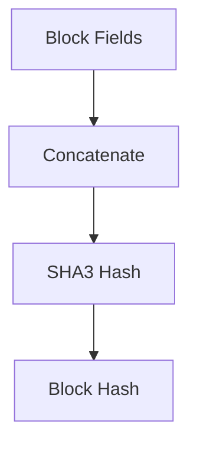
```mermaid
flowchart TD
    A[Block Fields] --> B[Concatenate]
    B --> C[SHA3 Hash]
    C --> D[Block Hash]
```

#### `poa_sign_block(...)`

```text
payload = block_hash || "|" || validator_id || "|" || authority_round
poa_signature = HMAC-SHA256(validator_key, payload)
```

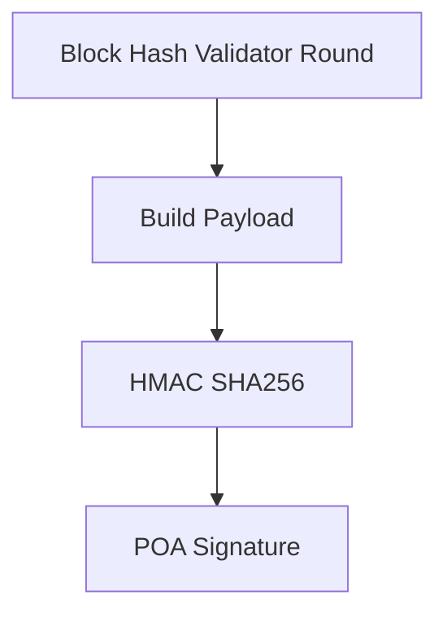
```mermaid
flowchart TD
    A[Block Hash Validator Round] --> B[Build Payload]
    B --> C[HMAC SHA256]
    C --> D[POA Signature]
```

#### `Block.compute_hashes(...)`

```text
telemetry_hash_sha2 = SHA2-256(telemetry_string)
telemetry_hash_sha3 = SHA3-256(telemetry_string)
event_hash_sha2 = SHA2-256(event_data)
event_hash_sha3 = SHA3-256(event_data)
dual_hash_combined = SHA2-256(block_hash) || ":" || SHA3-256(block_hash)
biometric_hash_sha3 = SHA3-256(heart_rate|drowsiness|unwell_flag)
```

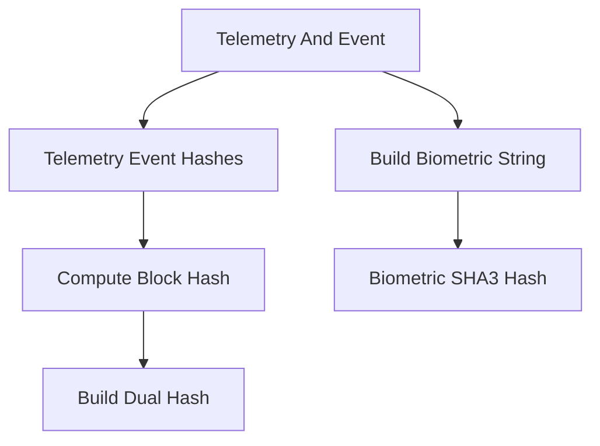
```mermaid
flowchart TD
    A[Telemetry And Event] --> B[Telemetry Event Hashes]
    B --> C[Compute Block Hash]
    C --> D[Build Dual Hash]
    A --> E[Build Biometric String]
    E --> F[Biometric SHA3 Hash]
```

#### `SmartCarCrypto.encrypt(plaintext)`

```text
key = PBKDF2-HMAC-SHA256(password, salt, 100000, 64 bytes)
ciphertext = plaintext XOR keystream
mac = HMAC-SHA256(mac_key, nonce || ciphertext)
package = base64(nonce || mac || ciphertext)
```

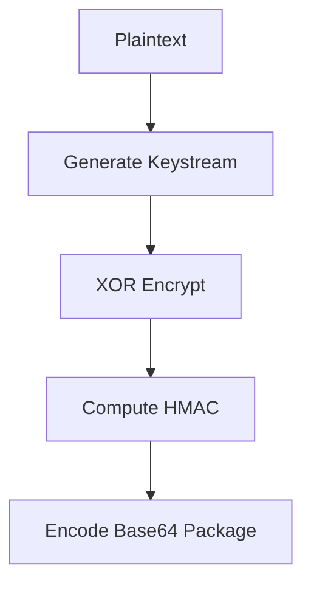
```mermaid
flowchart TD
    A[Plaintext] --> B[Generate Keystream]
    B --> C[XOR Encrypt]
    C --> D[Compute HMAC]
    D --> E[Encode Base64 Package]
```

#### `SmartCarCrypto.decrypt(encrypted_b64)`

```text
expected_mac = HMAC-SHA256(mac_key, nonce || ciphertext)
if mac != expected_mac => reject
plaintext = ciphertext XOR keystream
```

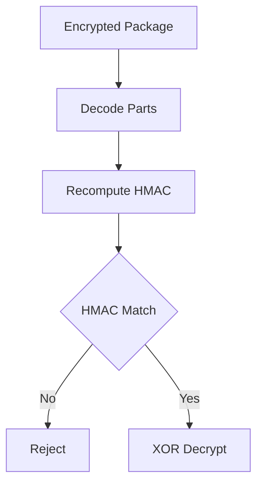
```mermaid
flowchart TD
    A[Encrypted Package] --> B[Decode Parts]
    B --> C[Recompute HMAC]
    C --> D{HMAC Match}
    D -->|No| E[Reject]
    D -->|Yes| F[XOR Decrypt]
```

### `zkp_privacy.py`
Related image: `image_source/Zero-Knowladge-proofs.png`, `image_source/privacy-security-flow.png`

#### `commit(value, blind)`

```text
C = (G^(value mod Q) * H^r) mod P
```

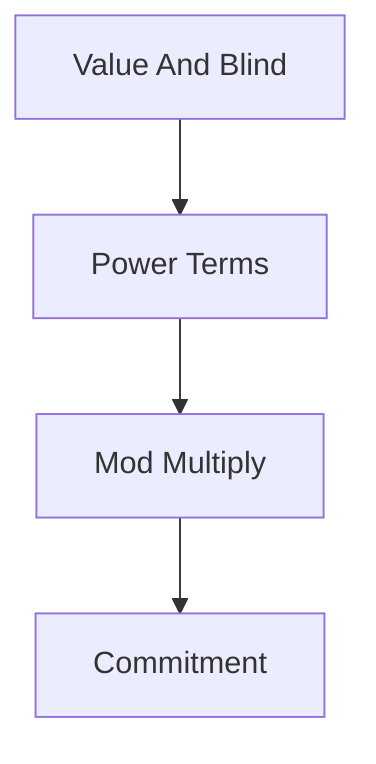
```mermaid
flowchart TD
    A[Value And Blind] --> B[Power Terms]
    B --> C[Mod Multiply]
    C --> D[Commitment]
```

#### `prove_knowledge(...)`

```text
t  = (G^k1 * H^k2) mod P
ch = H(commitment|t|context) mod Q
s1 = (k1 + ch*value) mod Q
s2 = (k2 + ch*blind) mod Q
```

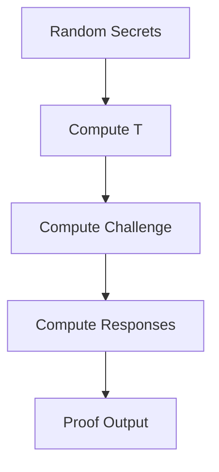
```mermaid
flowchart TD
    A[Random Secrets] --> B[Compute T]
    B --> C[Compute Challenge]
    C --> D[Compute Responses]
    D --> E[Proof Output]
```

#### `verify_knowledge(...)`

```text
lhs = (G^s1 * H^s2) mod P
rhs = (t * commitment^ch) mod P
valid = (lhs == rhs)
```

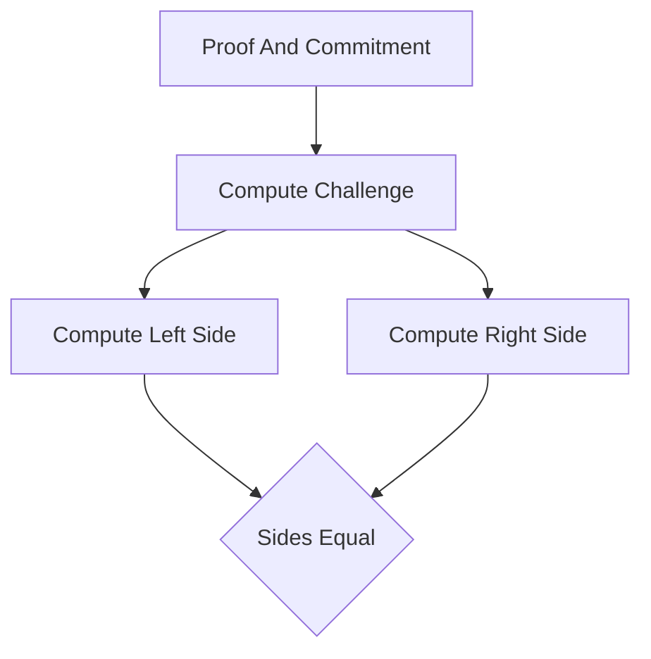
```mermaid
flowchart TD
    A[Proof And Commitment] --> B[Compute Challenge]
    B --> C[Compute Left Side]
    B --> D[Compute Right Side]
    C --> E{Sides Equal}
    D --> E
```

#### `create_speed_limit_proof(...)`

```text
speed = round(speed_kmh), speed >= 0
diff = limit - speed
relation_blind = (r_speed + r_diff) mod Q
```

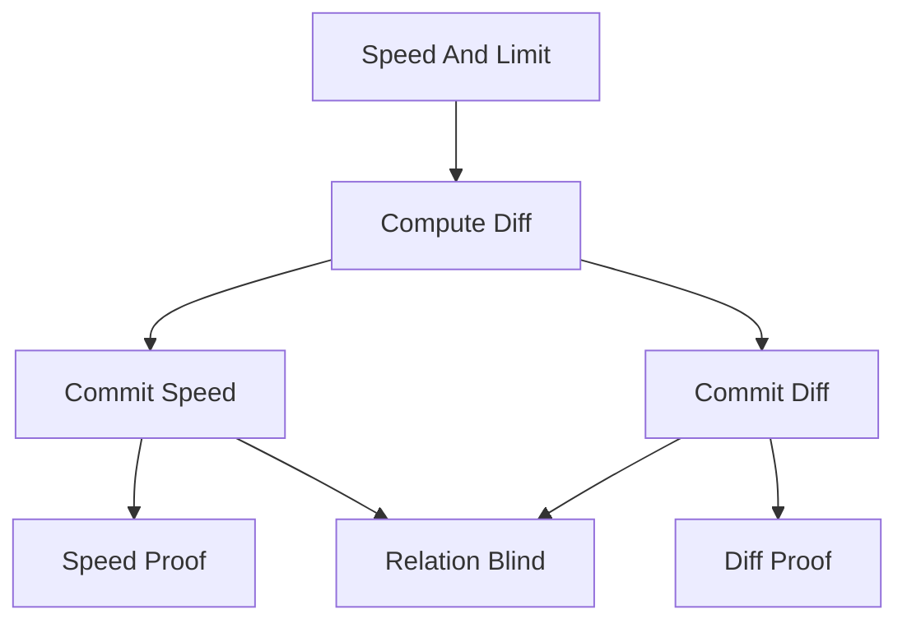
```mermaid
flowchart TD
    A[Speed And Limit] --> B[Compute Diff]
    B --> C[Commit Speed]
    B --> D[Commit Diff]
    C --> E[Speed Proof]
    D --> F[Diff Proof]
    C --> G[Relation Blind]
    D --> G
```

#### `verify_speed_limit_proof(...)`

```text
lhs = (commit_speed * commit_diff) mod P
rhs = (G^limit * H^relation_blind) mod P
valid = proof_speed_ok AND proof_diff_ok AND (lhs == rhs)
```

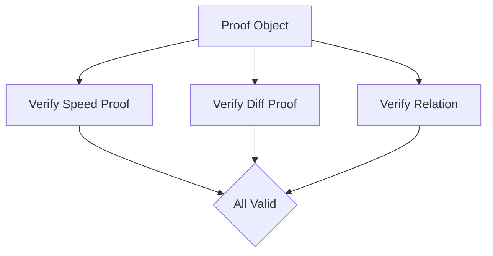
```mermaid
flowchart TD
    A[Proof Object] --> B[Verify Speed Proof]
    A --> C[Verify Diff Proof]
    A --> D[Verify Relation]
    B --> E{All Valid}
    C --> E
    D --> E
```

### `anomaly_detector.py`
Related image: `image_source/privacy-security-flow.png`

#### `_mean_std(key)`

```text
mean = sum(vals)/n
var  = sum((v-mean)^2)/(n-1)
std  = sqrt(var)
```

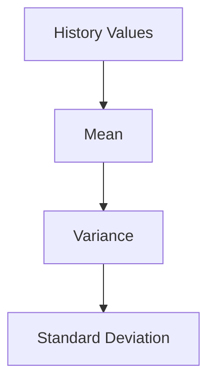
```mermaid
flowchart TD
    A[History Values] --> B[Mean]
    B --> C[Variance]
    C --> D[Standard Deviation]
```

#### `detect_telemetry(telemetry)`

```text
z = |(x-mean)/std|
zsum = z_speed + z_accel + z_temp + z_rpm
score += zsum/4 + rule_based_penalties
is_anomaly = (score >= threshold) OR (reason_count >= 2)
```

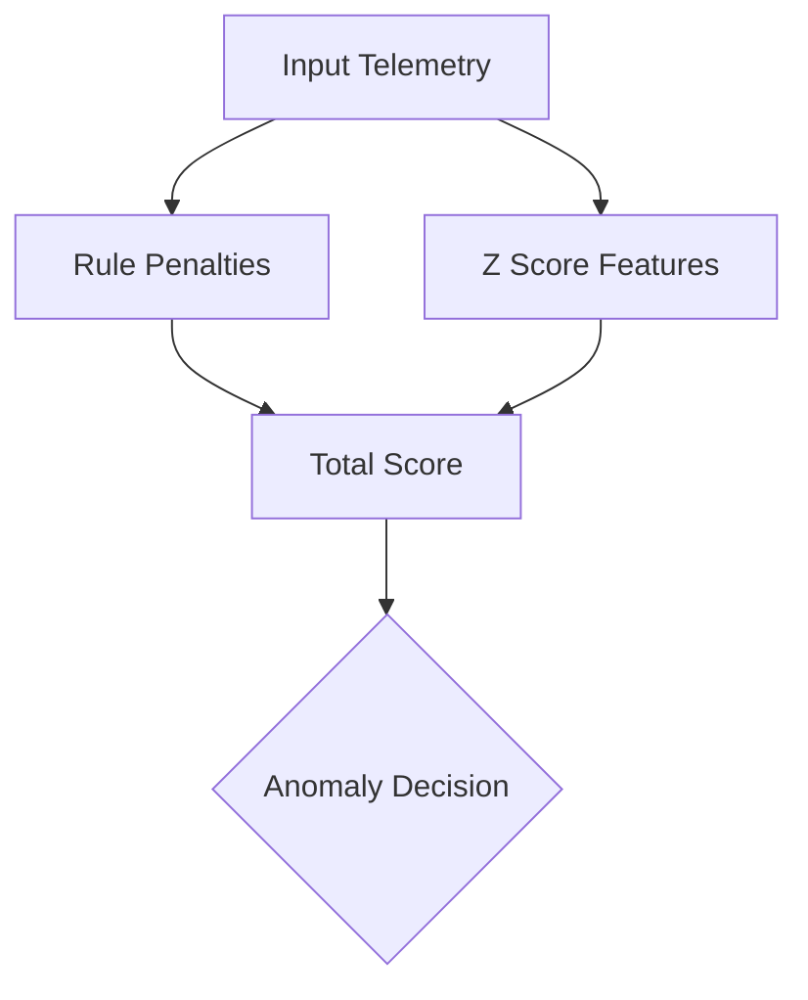
```mermaid
flowchart TD
    A[Input Telemetry] --> B[Rule Penalties]
    A --> C[Z Score Features]
    B --> D[Total Score]
    C --> D
    D --> E{Anomaly Decision}
```

### `edge_layer.py`
Related image: `image_source/commonication-blockchain-synctrization.png`

#### `_avg(vals)`

```text
avg = sum(vals)/len(vals)
```

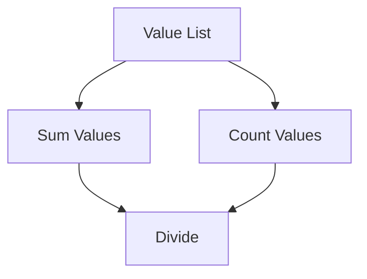
```mermaid
flowchart TD
    A[Value List] --> B[Sum Values]
    A --> C[Count Values]
    B --> D[Divide]
    C --> D
```

#### `_flush(event_hint)`

```text
speed      = avg(speed_vals)
obstacle   = min(obs_vals)
brake      = max(brake_vals)
drowsiness = max(drowsy_vals)
```

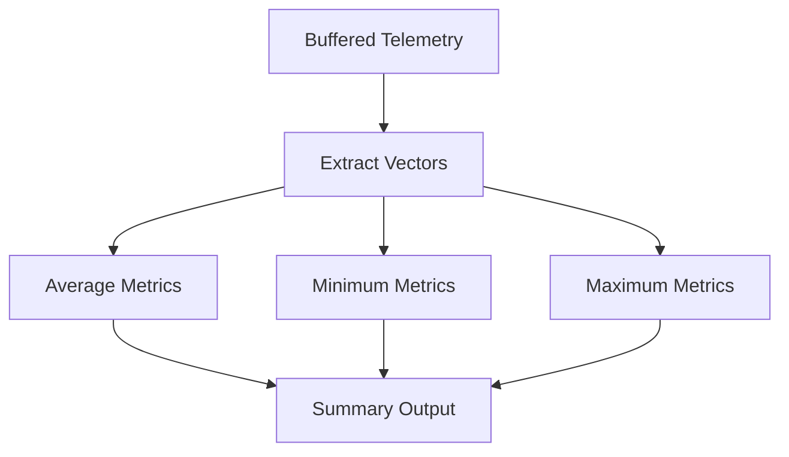
```mermaid
flowchart TD
    A[Buffered Telemetry] --> B[Extract Vectors]
    B --> C[Average Metrics]
    B --> D[Minimum Metrics]
    B --> E[Maximum Metrics]
    C --> F[Summary Output]
    D --> F
    E --> F
```

### `vehicle_sensors.py`
Related image: `image_source/road_scene.svg`

#### `GPSSimulator.update(speed_kmh, heading_change)`

```text
speed_ms = speed_kmh / 3.6
d = speed_ms * dt / 111111
lat += d * cos(heading_rad)
lon += d * sin(heading_rad)
```

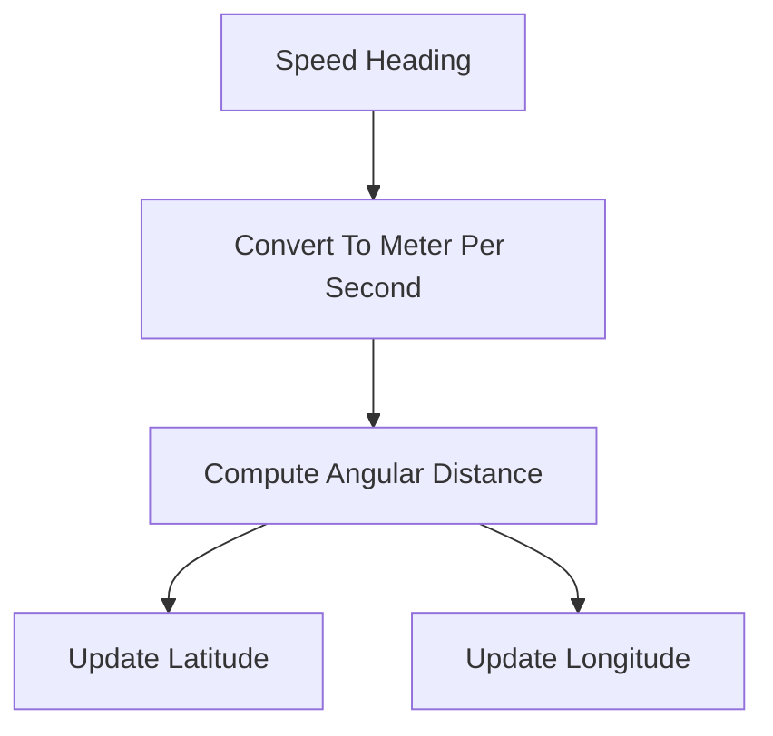
```mermaid
flowchart TD
    A[Speed Heading] --> B[Convert To Meter Per Second]
    B --> C[Compute Angular Distance]
    C --> D[Update Latitude]
    C --> E[Update Longitude]
```

#### `EngineSimulator.update(throttle, dt)`

```text
target_rpm = 800 + (throttle/100)*6200
rpm += (target_rpm - rpm)*0.1
fuel -= (0.00001 + throttle*0.000005)*dt
oil_pressure = 3.5 + (rpm/6000)*1.5 + noise
```

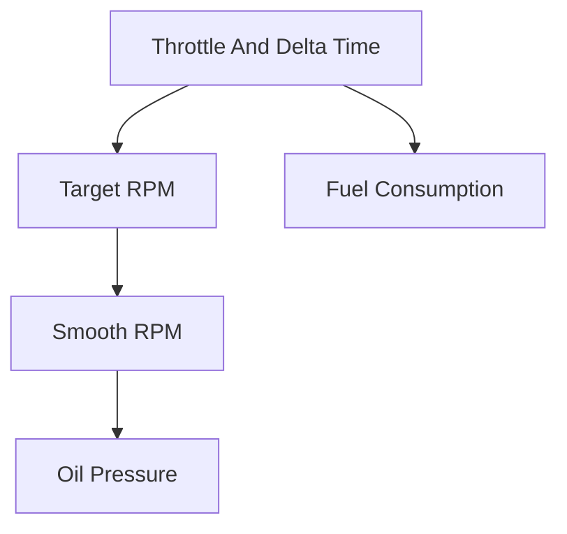
```mermaid
flowchart TD
    A[Throttle And Delta Time] --> B[Target RPM]
    B --> C[Smooth RPM]
    A --> D[Fuel Consumption]
    C --> E[Oil Pressure]
```

#### `EmergencyBrakeController._on_obstacle_detected(obstacle)`

```text
if distance < 30m: brake_pressure = 100
else brake_pressure = (1 - distance/100)*100
```

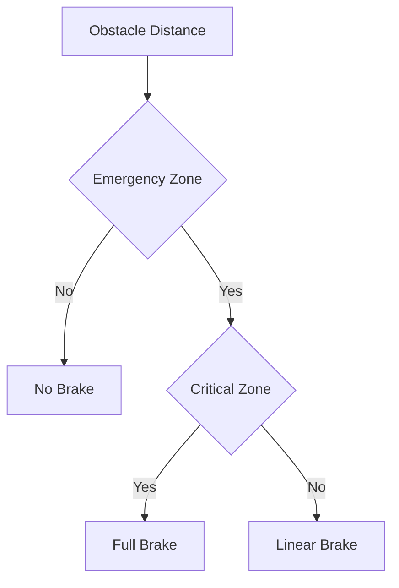
```mermaid
flowchart TD
    A[Obstacle Distance] --> B{Emergency Zone}
    B -->|No| C[No Brake]
    B -->|Yes| D{Critical Zone}
    D -->|Yes| E[Full Brake]
    D -->|No| F[Linear Brake]
```

### `dashboard.py`
Related image: `image_source/road_scene.svg`, `image_source/project_theam.jpg`

#### `_estimate_distance(box_h)`

```text
distance_m = (1.70 * 850.0) / box_h
```

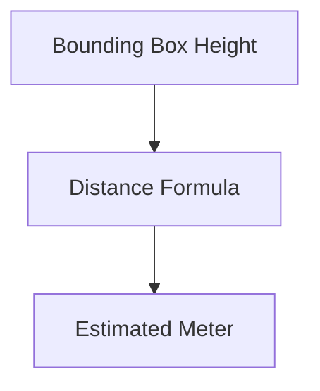
```mermaid
flowchart TD
    A[Bounding Box Height] --> B[Distance Formula]
    B --> C[Estimated Meter]
```

#### `_draw_speedometer()`

```text
angle_deg = 162 - (speed/220)*144
needle_x = cx + (r-30)*cos(angle)
needle_y = cy - (r-30)*sin(angle)
```

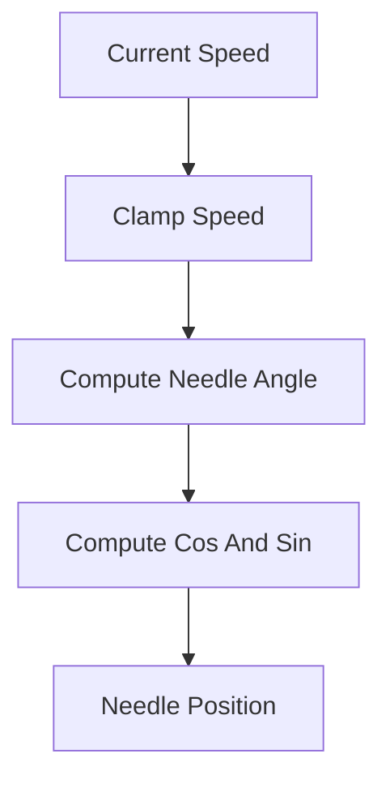
```mermaid
flowchart TD
    A[Current Speed] --> B[Clamp Speed]
    B --> C[Compute Needle Angle]
    C --> D[Compute Cos And Sin]
    D --> E[Needle Position]
```

#### `_update_model()`

```text
target_speed = throttle * 1.6
speed += (target_speed - speed) * 0.12
rpm = 900 + speed * 36
odometer += (speed / 3600) * 0.08
risk = 0.01 + emergency_term + detection_term + obstacle_term + overspeed_term + noise
```

```mermaid
flowchart TD
    A[Throttle And Current State] --> B[Update Speed]
    B --> C[Update RPM Temp Fuel Odometer]
    C --> D[Compute Risk Score]
    D --> E[Append Anomaly History]
```

### `federated_learning.py`
Related image: `image_source/federaated-learning-flow.png`

#### `_sigmoid(x)`

```text
sigmoid(x) = 1 / (1 + exp(-clip(x,-40,40)))
```

```mermaid
flowchart TD
    A[Input Vector] --> B[Clip Input]
    B --> C[Exponential]
    C --> D[Sigmoid Output]
```

#### `FederatedObstacleLearner._extract_features(telemetry)`

```text
speed_norm = clip(speed/180, 0, 1)
accel_norm = clip(|accel|/12, 0, 1)
brake_norm = clip(brake/100, 0, 1)
temp_norm  = clip((temp-60)/60, 0, 1)
near_obstacle = 1 if distance<=35 else 0
hr_risk = 1 if hr<=45 or hr>=140 else 0
```

```mermaid
flowchart TD
    A[Telemetry] --> B[Normalize Continuous Features]
    A --> C[Compute Threshold Features]
    B --> D[Feature Vector]
    C --> D
```

#### `FederatedObstacleLearner._train_batch(x,y,epochs)`

```text
logits = Xw
pred = sigmoid(logits)
grad = X^T(pred - y)/n
w = w - lr*grad
loss = -mean(y*log(pred)+(1-y)*log(1-pred))
```

```mermaid
flowchart TD
    A[Input Batch] --> B[Forward Pass]
    B --> C[Gradient]
    C --> D[Weight Update]
    D --> E[Loss Value]
```

#### `FederatedObstacleLearner._clip_delta(delta, clip_norm)`

```text
n = ||delta||2
if n > c: delta = delta * (c/n)
```

```mermaid
flowchart TD
    A[Delta Vector] --> B[Norm]
    B --> C{Above Clip}
    C -->|Yes| D[Scale Delta]
    C -->|No| E[Keep Delta]
```

#### `FederatedTrainer._mad_filter(vals,k)`

```text
med = median(vals)
mad = median(|vals - med|) + 1e-9
z = |vals - med| / mad
keep = z <= k
```

```mermaid
flowchart TD
    A[Norm Values] --> B[Median]
    B --> C[MAD]
    C --> D[Robust Score]
    D --> E[Keep Mask]
```

#### `FederatedTrainer._robust_weighted_trimmed_mean(...)`

```text
sort each feature column
trim lowest/highest ratio
output_j = sum(col_j * weight_j)/sum(weight_j)
```

```mermaid
flowchart TD
    A[Client Deltas And Weights] --> B[Sort Per Feature]
    B --> C[Trim Tails]
    C --> D[Weighted Mean]
    D --> E[Aggregated Delta]
```

### `v2x_protocol.py`
Related image: `image_source/commonication-blockchain-synctrization.png`

#### `DynamicCryptoAgilityLayer._agility_score(recommended_mode)`

```text
avg_rtt = mean(rtt_history)
mps = msg_count / window_sec
latency_component = min(1, avg_rtt/latency_hi_ms)
traffic_component = min(1, mps/traffic_hi_mps)
score = wL*latency_component + wT*traffic_component
```

```mermaid
flowchart TD
    A[RTT History] --> B[Latency Component]
    C[Message History] --> D[Traffic Component]
    B --> E[Weighted Score]
    D --> E
```

#### `DynamicCryptoAgilityLayer.maybe_switch_mode(...)`

```text
if mode=DILITHIUM and score>=up_thr -> target=SHA3
if mode=SHA3 and score<=down_thr -> target=DILITHIUM
switch only after confirm_count and switch_interval_sec
```

```mermaid
flowchart TD
    A[Current Mode And Score] --> B[Target Mode]
    B --> C[Confirmation Counter]
    C --> D{Ready To Switch}
    D -->|Yes| E[Switch Mode]
    D -->|No| F[Keep Mode]
```

#### `V2XHub._recommend_crypto_mode()`

```text
score = 0.5*traffic_ratio + 0.3*client_load_ratio + 0.2*latency_ratio
mode = SHA3 if score>=0.66 else DILITHIUM
```

```mermaid
flowchart TD
    A[Messages Per Second] --> B[Traffic Ratio]
    C[Client Count] --> D[Load Ratio]
    E[Latency Hint] --> F[Latency Ratio]
    B --> G[Weighted Score]
    D --> G
    F --> G
    G --> H[Choose Crypto Mode]
```

### `network_overhead_analysis.py`
Related image: `image_source/commonication-blockchain-synctrization.png`

#### `analyze()`

```text
overhead_pct = ((protocol_bytes - plain_bytes) / plain_bytes) * 100
```

Applied for:
- `protocol_no_mac_bytes`
- `protocol_hmac_bytes`
- `encrypted_hmac_bytes`

```mermaid
flowchart TD
    A[Plain Bytes] --> B[Protocol Bytes]
    B --> C[Subtract]
    A --> D[Divide]
    C --> D
    D --> E[Multiply By Hundred]
```

### `did_identity.py`
Related image: `image_source/privacy-security-flow.png`

#### `_msg_bits(message)`

```text
digest = SHA3-256(message)
bits[i] = (byte >> shift) & 1
```

```mermaid
flowchart TD
    A[Message] --> B[SHA3 Digest Bytes]
    B --> C[Bit Extraction]
    C --> D[Bit Vector]
```

#### `verify_did_proof(challenge, proof, did_document)`

```text
challenge_hash == SHA3-256(challenge)
for each i: SHA3(signature[i]) == public_pairs[i][bit_i]
```

```mermaid
flowchart TD
    A[Challenge Proof Document] --> B[Challenge Hash Check]
    B --> C[Lamport Verify Loop]
    C --> D{All Matched}
```

### Additional Missing Math (Added)
Related image: `image_source/System-Architechture.png`

#### `blockchain.py::LocalStorageCipher.encrypt_payload(payload)`

```text
key = PBKDF2-HMAC-SHA256(passphrase, salt, iterations, 32 bytes)
ciphertext = AES-256-GCM(key, nonce, plaintext, aad)
```

#### `blockchain.py::_archive_shard_root(blocks)`

```text
leaf_i = SHA3-256(index|block_hash|telemetry_hash|event_hash|previous_hash)
parent = SHA3-256(left || right)
repeat until single root hash
```

#### `blockchain.py::_build_merkle_proof(...)` and `_verify_merkle_proof(...)`

```text
proof step = {position, sibling_hash}
verify by iterative hashing from leaf to root
```

#### `blockchain.py::_evaluate_pop_consensus(...)`

```text
own_valid = min_dist <= own_distance <= max_dist
participants = (1 if own_valid else 0) + selected_neighbor_count
approved = own_valid AND participants >= required_participants
```

#### `dashboard.py::_refresh_v2x_nodes()`

```text
ang  = (now * (0.6 + i*0.08) + i*0.9) mod (2*pi)
dist = 0.2 + ((sin(now*0.3 + i) + 1) * 0.35)
```

## Only Math (No Mermaid)

### `blockchain.py`
```text
sha2 = SHA2-256(data)
sha3 = SHA3-256(data)
combined = SHA2-256(data + sha3)

raw = index || timestamp || vehicle_id || telemetry_hash_sha3 || event_hash_sha3 || previous_hash
block_hash = SHA3-256(raw)

payload = block_hash || "|" || validator_id || "|" || authority_round
poa_signature = HMAC-SHA256(validator_key, payload)

telemetry_hash_sha2 = SHA2-256(telemetry_string)
telemetry_hash_sha3 = SHA3-256(telemetry_string)
event_hash_sha2 = SHA2-256(event_data)
event_hash_sha3 = SHA3-256(event_data)
dual_hash_combined = SHA2-256(block_hash) || ":" || SHA3-256(block_hash)
biometric_hash_sha3 = SHA3-256(heart_rate|drowsiness|unwell)

key = PBKDF2-HMAC-SHA256(password, salt, 100000, 64 bytes)
ciphertext = plaintext XOR keystream
mac = HMAC-SHA256(mac_key, nonce || ciphertext)

storage_key = PBKDF2-HMAC-SHA256(passphrase, salt, iterations, 32 bytes)
ciphertext = AES-256-GCM(storage_key, nonce, plaintext, aad)

leaf_i = SHA3-256(index|block_hash|telemetry_hash|event_hash|previous_hash)
parent = SHA3-256(left || right)

own_valid = min_dist <= own_distance <= max_dist
participants = (1 if own_valid else 0) + valid_neighbor_count
approved = own_valid AND participants >= required_participants
```

### `zkp_privacy.py`
```text
C = (G^(value mod Q) * H^r) mod P

t = (G^k1 * H^k2) mod P
ch = H(commitment|t|context) mod Q
s1 = (k1 + ch*value) mod Q
s2 = (k2 + ch*blind) mod Q

lhs = (G^s1 * H^s2) mod P
rhs = (t * commitment^ch) mod P
valid = (lhs == rhs)

speed = round(speed_kmh), speed >= 0
diff = limit - speed
relation_blind = (r_speed + r_diff) mod Q

lhs = (commit_speed * commit_diff) mod P
rhs = (G^limit * H^relation_blind) mod P
valid = proof_speed_ok AND proof_diff_ok AND (lhs == rhs)
```

### `anomaly_detector.py`
```text
mean = sum(vals)/n
var = sum((v-mean)^2)/(n-1)
std = sqrt(var)

z = |(x-mean)/std|
score += (z_speed + z_accel + z_temp + z_rpm)/4 + rule_penalties
is_anomaly = (score >= threshold) OR (reason_count >= 2)
```

### `edge_layer.py`
```text
avg = sum(vals)/len(vals)
speed = avg(speed_vals)
obstacle_distance = min(obs_vals)
brake_pressure = max(brake_vals)
drowsiness = max(drowsy_vals)
```

### `vehicle_sensors.py`
```text
speed_ms = speed_kmh / 3.6
d = speed_ms * dt / 111111
lat += d * cos(heading)
lon += d * sin(heading)

target_rpm = 800 + (throttle/100)*6200
rpm += (target_rpm - rpm)*0.1
fuel -= (0.00001 + throttle*0.000005)*dt
oil_pressure = 3.5 + (rpm/6000)*1.5 + noise

if distance < 30: brake_pressure = 100
else: brake_pressure = (1 - distance/100)*100
```

### `dashboard.py`
```text
distance_m = (1.70 * 850.0) / box_h

angle_deg = 162 - (speed/220)*144
needle_x = cx + (r-30)*cos(angle)
needle_y = cy - (r-30)*sin(angle)

target_speed = throttle * 1.6
speed += (target_speed - speed) * 0.12
rpm = 900 + speed * 36
odometer += (speed / 3600) * 0.08

ang = (now * (0.6 + i*0.08) + i*0.9) mod (2*pi)
dist = 0.2 + ((sin(now*0.3 + i) + 1) * 0.35)
```

### `federated_learning.py`
```text
sigmoid(x) = 1 / (1 + exp(-clip(x,-40,40)))

speed_norm = clip(speed/180, 0, 1)
accel_norm = clip(|accel|/12, 0, 1)
brake_norm = clip(brake/100, 0, 1)
temp_norm = clip((temp-60)/60, 0, 1)
near_obstacle = 1 if distance <= 35 else 0
hr_risk = 1 if hr <= 45 or hr >= 140 else 0

logits = Xw
pred = sigmoid(logits)
grad = X^T(pred-y)/n
w = w - lr*grad
loss = -mean(y*log(pred)+(1-y)*log(1-pred))

n = ||delta||2
if n > c: delta = delta * (c/n)

med = median(vals)
mad = median(|vals-med|) + 1e-9
z = |vals-med| / mad
keep = z <= k

output_j = sum(col_j * weight_j) / sum(weight_j)
```

### `v2x_protocol.py`
```text
latency_component = min(1, avg_rtt/latency_hi)
traffic_component = min(1, mps/traffic_hi)
score = wL*latency_component + wT*traffic_component

if mode == DILITHIUM and score >= up_threshold: target = SHA3
if mode == SHA3 and score <= down_threshold: target = DILITHIUM

hub_score = 0.5*traffic_ratio + 0.3*client_ratio + 0.2*latency_ratio
mode = SHA3 if hub_score >= 0.66 else DILITHIUM
```

### `network_overhead_analysis.py`
```text
overhead_pct = ((protocol_bytes - plain_bytes) / plain_bytes) * 100
```

### `did_identity.py`
```text
digest = SHA3-256(message)
bit = (byte >> shift) & 1

challenge_hash == SHA3-256(challenge)
for each i: SHA3(signature_i) == public_pairs_i[bit_i]
```

## Docstring Update

Short docstrings were added in updated modules for maintainability:

- `zkp_privacy.py`
- `sync_protocol.py`
- `v2x_protocol.py`
- `env_config.py`

## Run

Start GUI:

```bash
python main.py
```

Optional demos:

```bash
python multi_car_majority_demo.py
python v2x_demo_nodes.py
python pqc_kyber_handshake_test.py
python attacker_fake_zkp.py
python zkp_latency_report.py
python network_overhead_analysis.py
python decentralized_fl_demo.py
python fl_trainer_node.py
```

Camera C++ module:

```bash
g++ camera_emergency_brake.cpp -o camera_emergency_brake `pkg-config --cflags --libs opencv4`
./camera_emergency_brake
```

## Final Check (Current)

- Root-level architecture is in sync with flattened project layout
- GUI starts from `main.py` and opens in fullscreen mode
- Right panel supports mouse-wheel scrolling
- Access status block shows `LOCK`, `AUTH`, and `ENGINE (START/STOP)` live
- Dual Hash Chain panel is placed below Road Scene and Blockchain Ledger Feed
- `_update_ui` and network stack now log exceptions instead of silent pass
