# OmniGuard V2X: A Privacy-Preserving Blockchain Framework for Smart Vehicle Security

## 1. Project Name, Developer, Author, Role, Description
- Project Name: `OmniGuard V2X`
- Developer: `Md Shahanur Islam Shagor`
- Author: `Md Shahanur Islam Shagor`
- Role: `Project Architect & Lead Developer`
- Description: Smart-car security research platform where blockchain, ZKP privacy, DID identity, V2X communication, anomaly defense, edge processing, federated learning, forensic logging, and hardware control are integrated into one end-to-end system.

## 2. Project Layers
1. Presentation Layer
- `main.py`, `dashboard.py`
- Live UI, camera detection, speed/radar/map, chain feed, control panel.

2. Application Layer
- `blockchain.py`, `smart_contracts.py`, `edge_layer.py`, `anomaly_detector.py`, `did_identity.py`
- Chain logic, contracts, edge summarization, anomaly scoring, DID verification.

3. Network Layer
- `sync_protocol.py`, `v2x_protocol.py`, `v2x_demo_nodes.py`, `multi_car_majority_demo.py`
- Sync packets, V2V/V2I message flow, majority validation demos.

4. Privacy and Crypto Layer
- `zkp_privacy.py`
- Commitment-based proofs for speed and location ownership privacy.

5. Hardware and Edge Integration Layer
- `hardware_bridge.py`, `pi_sensor_node.py`, `SmartCarSensorNode.ino`, `camera_emergency_brake.cpp`, `vehicle_sensors.py`
- Sensor fusion, emergency braking path, ECU bridge.

6. Observability and Analytics Layer
- `perf_metrics.py`, `zkp_latency_report.py`, `network_overhead_analysis.py`, `logs/`
- ZKP latency logs, overhead reports, runtime forensic artifacts.

## 3. Folder Structure + Project Theme Image


```text
Smart Car - Blockchain for Vehicle Security/
|-- main.py
|-- dashboard.py
|-- blockchain.py
|-- blockchain.cpp
|-- blockchain.h
|-- zkp_privacy.py
|-- v2x_protocol.py
|-- sync_protocol.py
|-- did_identity.py
|-- smart_contracts.py
|-- edge_layer.py
|-- anomaly_detector.py
|-- federated_learning.py
|-- vehicle_sensors.py
|-- hardware_bridge.py
|-- pi_sensor_node.py
|-- network_overhead_analysis.py
|-- fl_trainer_node.py
|-- decentralized_fl_demo.py
|-- readme.md
|-- requirements.txt
|-- .env
|-- logs/
|-- image_source/
|   |-- project_theam.jpg
|   |-- System-Architechture.png
|   |-- privacy-security-flow.png
|   |-- commonication-blockchain-synctrization.png
|   |-- federaated-learning-flow.png
|   |-- Zero-Knowladge-proofs.png
|   |-- Large-language-model.png
|   `-- road_scene.svg
`-- build/
```

## 4. Production-Oriented ZKP Parameters + Math + Mermaid + Image
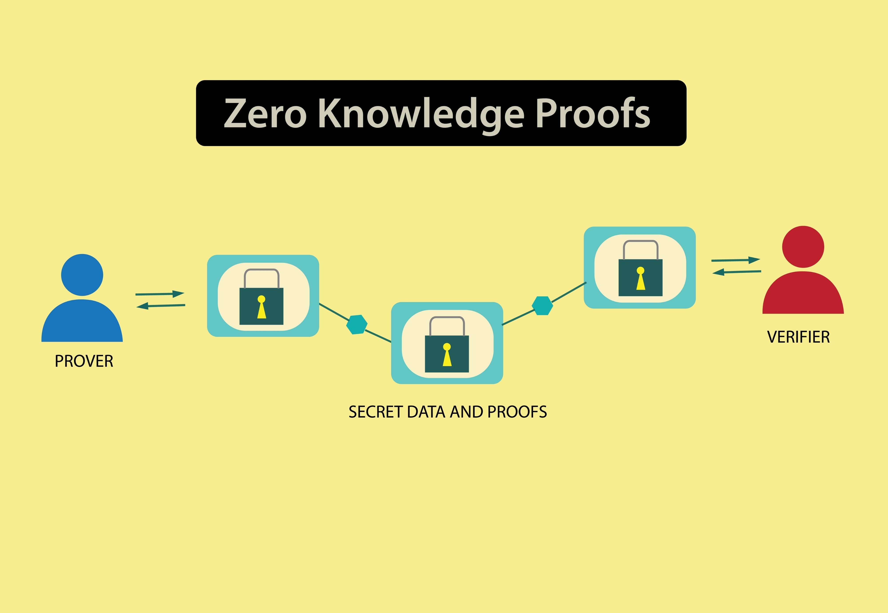

Key parameters from `.env`:
- `SMARTCAR_ZKP_PARAM_SET`
- `SMARTCAR_ZKP_P`, `SMARTCAR_ZKP_G`, `SMARTCAR_ZKP_H`

Math:
$$
C=(G^{value\bmod Q}\cdot H^r)\bmod P
$$
$$
ch=H(commitment\parallel t\parallel context)\bmod Q
$$

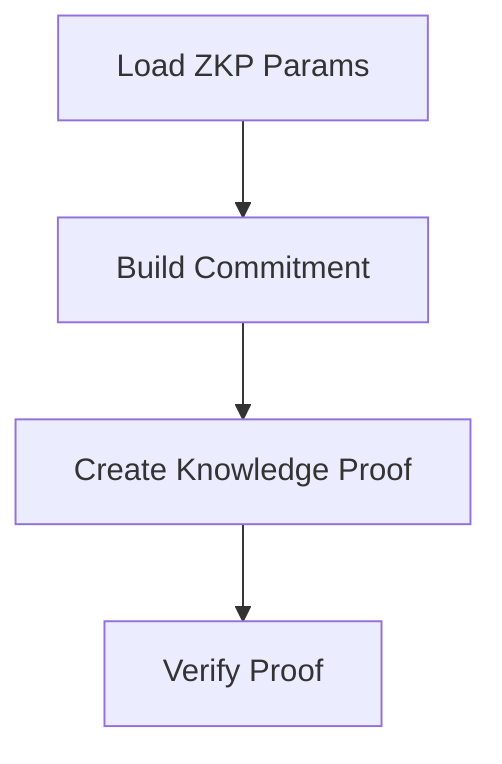
```mermaid
flowchart TD
    A[Load ZKP Params] --> B[Build Commitment]
    B --> C[Create Knowledge Proof]
    C --> D[Verify Proof]
```

## 5. Network Error Handling Hardening + Math + Mermaid + Image


Scope:
- Timeout retry loops
- Broken pipe and reset handling
- Safe send and safe shutdown paths

Math (reliability metric used operationally):
$$
success\_rate=\frac{successful\_messages}{total\_messages}\times 100
$$

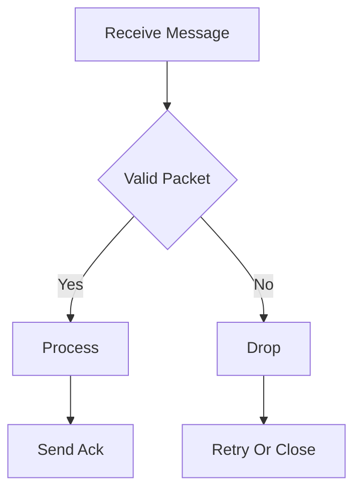
```mermaid
flowchart TD
    A[Receive Message] --> B{Valid Packet}
    B -->|Yes| C[Process]
    B -->|No| D[Drop]
    C --> E[Send Ack]
    D --> F[Retry Or Close]
```

## 6. Quantum-Resistant V2V Handshake (Dynamic PQC) + Math + Mermaid + Image


Crypto agility and handshake:
- PQC KEM preferred (`ML-KEM` or `Kyber`)
- Classical fallback (`ECDH + HKDF`)
- Dynamic `SHA3` vs `DILITHIUM` mode switching

Math:
$$
score=w_L\cdot latency\_component+w_T\cdot traffic\_component
$$
$$
latency\_component=\min\left(1,\frac{avg\_rtt}{latency\_high}\right),\quad
traffic\_component=\min\left(1,\frac{mps}{traffic\_high}\right)
$$

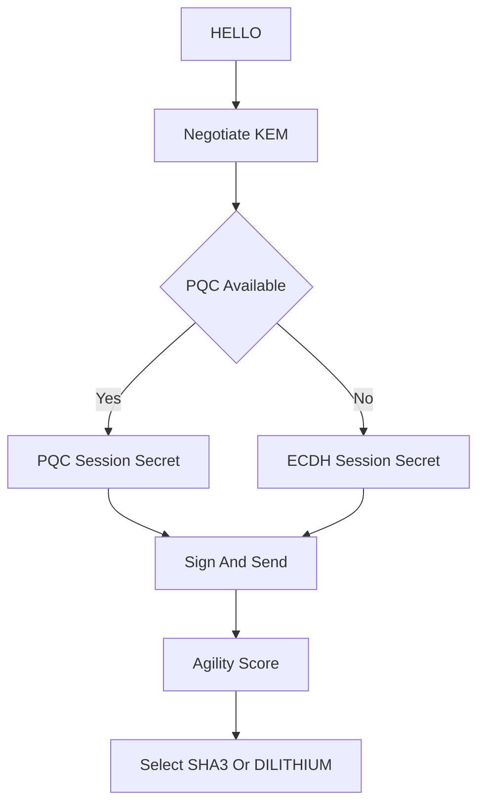
```mermaid
flowchart TD
    A[HELLO] --> B[Negotiate KEM]
    B --> C{PQC Available}
    C -->|Yes| D[PQC Session Secret]
    C -->|No| E[ECDH Session Secret]
    D --> F[Sign And Send]
    E --> F
    F --> G[Agility Score]
    G --> H[Select SHA3 Or DILITHIUM]
```

## 7. Local Storage Encryption (Blockchain File) + Math + Mermaid + Image
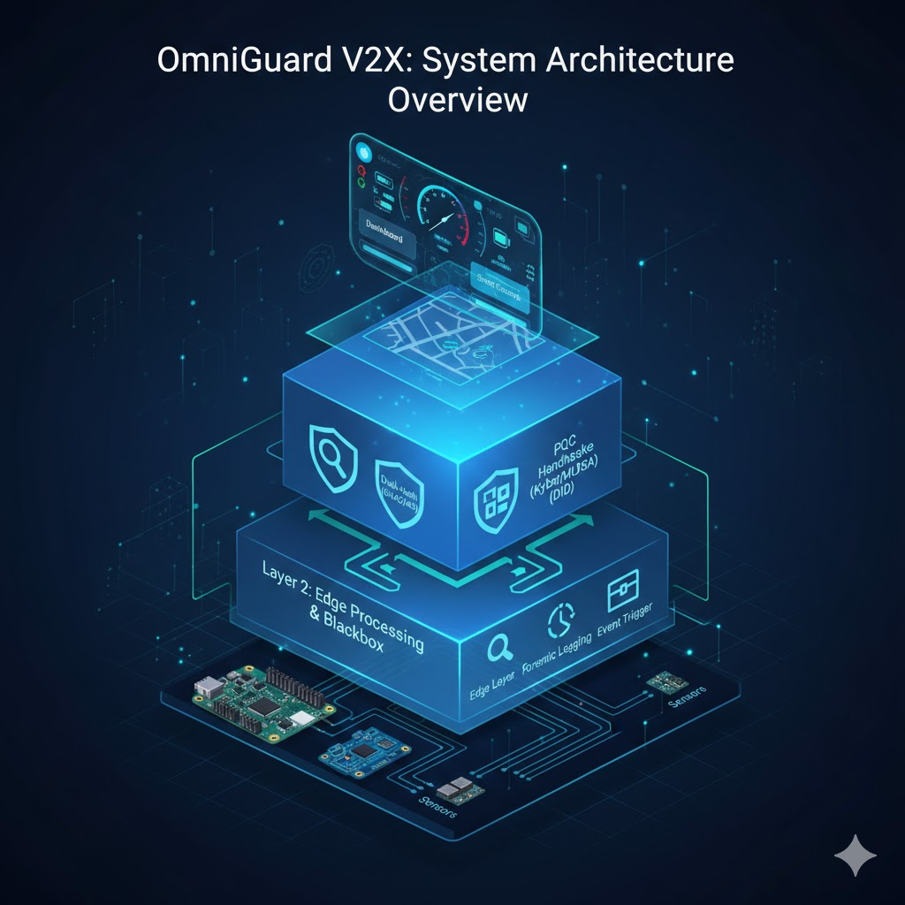

Storage modes:
- `AES-256-GCM` primary
- PBKDF2 based authenticated envelope fallback

Math:
$$
K=PBKDF2\text{-}HMAC\text{-}SHA256(passphrase,salt,iterations)
$$
$$
ciphertext=AES\text{-}256\text{-}GCM(K,nonce,plaintext,aad)
$$

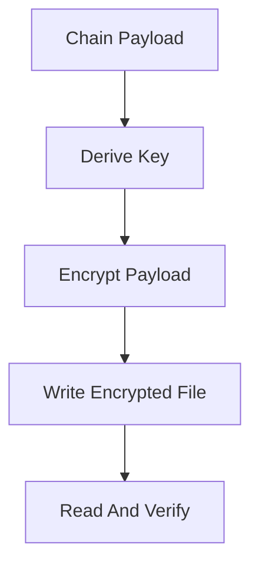
```mermaid
flowchart TD
    A[Chain Payload] --> B[Derive Key]
    B --> C[Encrypt Payload]
    C --> D[Write Encrypted File]
    D --> E[Read And Verify]
```

## 8. Encrypted Blackbox Logging (Forensic Analysis) + Math + Mermaid + Image
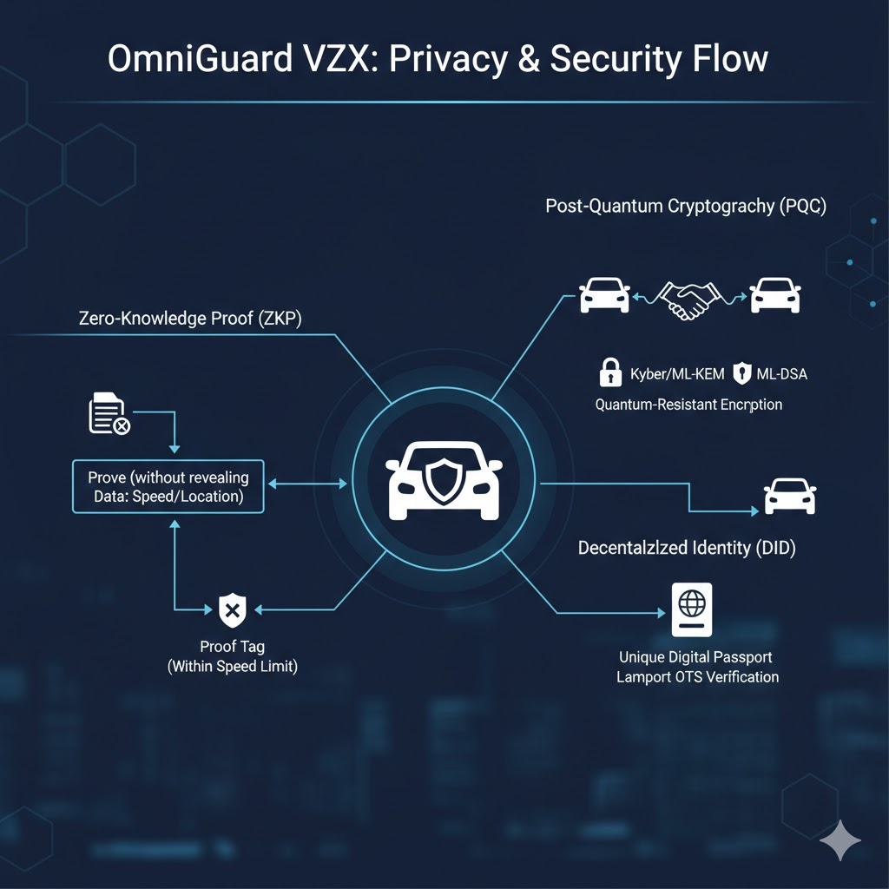

Flow:
- Rolling window capture
- Triggered forensic lock package
- Separate wrapped keys for forensic and insurance
- Inject forensic block to chain

Math:
$$
window\_samples=sample\_hz\times window\_sec
$$
$$
forensic\_trigger\_score=impact\_flag+hack\_flag+emergency\_flag
$$

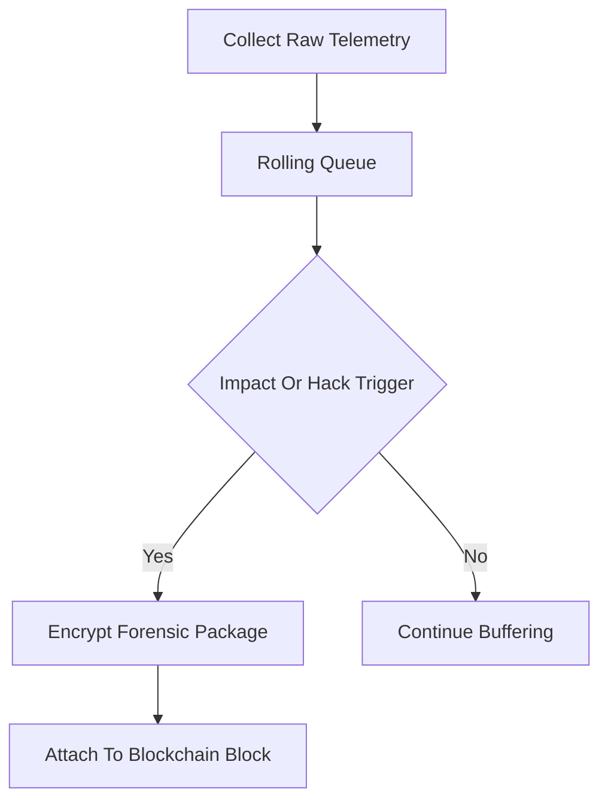
```mermaid
flowchart TD
    A[Collect Raw Telemetry] --> B[Rolling Queue]
    B --> C{Impact Or Hack Trigger}
    C -->|Yes| D[Encrypt Forensic Package]
    D --> E[Attach To Blockchain Block]
    C -->|No| F[Continue Buffering]
```

## 9. Multi-Modal Biometric Auth via Blockchain + Math + Mermaid + Image


Fields:
- `driver_heart_rate_bpm`
- `driver_drowsiness_score`
- `driver_unwell`

Math:
$$
biometric\_hash=SHA3\text{-}256(hr\parallel drowsiness\parallel unwell\_flag)
$$
$$
risk\_flag=(hr\le hr\_low)\lor(hr\ge hr\_high)\lor(drowsiness\ge threshold)\lor unwell
$$

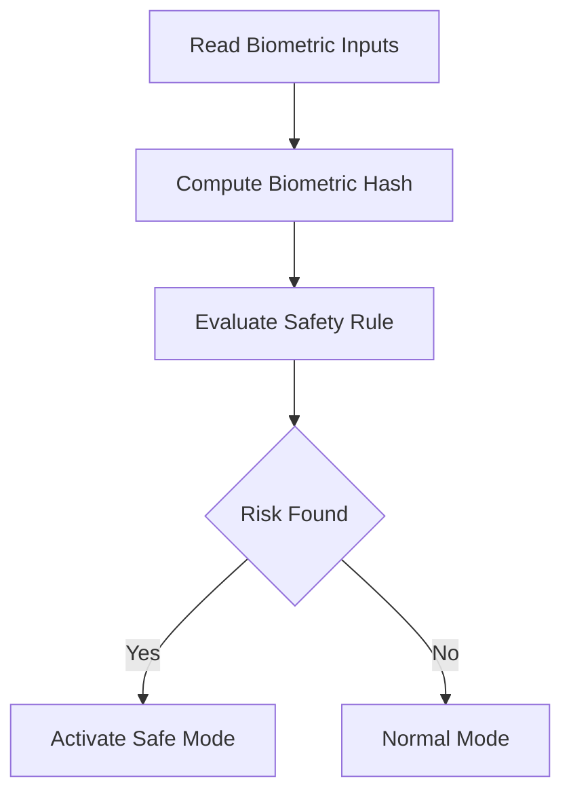
```mermaid
flowchart TD
    A[Read Biometric Inputs] --> B[Compute Biometric Hash]
    B --> C[Evaluate Safety Rule]
    C --> D{Risk Found}
    D -->|Yes| E[Activate Safe Mode]
    D -->|No| F[Normal Mode]
```

## 10. Decentralized AI-Model Training (Federated Learning) + Math + Mermaid + Image
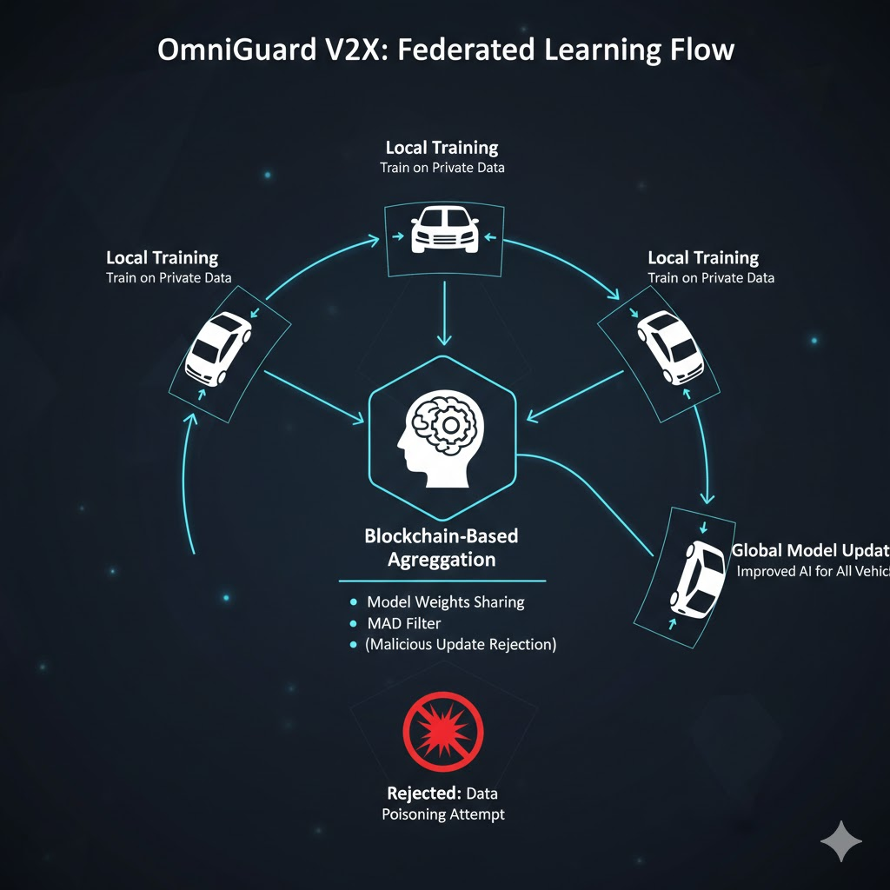

Training shape:
- Local logistic training on each vehicle
- Share only weight deltas
- Robust aggregation + outlier defense + DP noise

Math:
$$
\hat{y}=\sigma(Xw),\quad \sigma(x)=\frac{1}{1+e^{-x}}
$$
$$
\nabla_w=\frac{X^T(\hat{y}-y)}{n},\quad w\leftarrow w-\eta\nabla_w
$$
$$
\Delta'=
\begin{cases}
\Delta, & \|\Delta\|_2\le c \\
\Delta\cdot\frac{c}{\|\Delta\|_2}, & \|\Delta\|_2>c
\end{cases}
$$

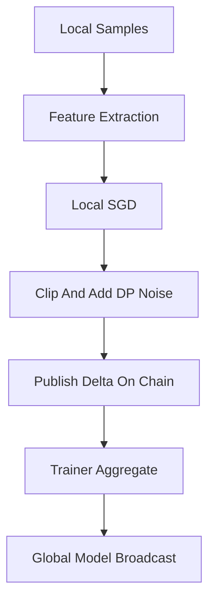
```mermaid
flowchart TD
    A[Local Samples] --> B[Feature Extraction]
    B --> C[Local SGD]
    C --> D[Clip And Add DP Noise]
    D --> E[Publish Delta On Chain]
    E --> F[Trainer Aggregate]
    F --> G[Global Model Broadcast]
```

## 11. Self-Healing Blockchain (Pruning + Sharding) + Math + Mermaid + Image


Core behavior:
- Archive old blocks into shards
- Keep root hash and anchor metadata on-chain
- Build and verify cross-shard proof
- Checkpoint state snapshots

Math:
$$
leaf_i=SHA3\text{-}256(index\parallel block\_hash\parallel telemetry\_hash\parallel event\_hash\parallel previous\_hash)
$$
$$
root=Merkle(leaf_1,leaf_2,\dots,leaf_n)
$$

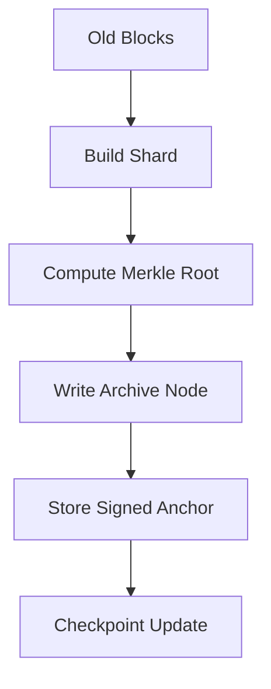
```mermaid
flowchart TD
    A[Old Blocks] --> B[Build Shard]
    B --> C[Compute Merkle Root]
    C --> D[Write Archive Node]
    D --> E[Store Signed Anchor]
    E --> F[Checkpoint Update]
```

## 12. Platooning Security with Proof-of-Proximity (PoP) + Math + Mermaid + Image


PoP rule:
- Own distance must be in range
- Neighbor confirmations must pass confidence threshold
- Approval bound to proof hash in block metadata

Math:
$$
own\_valid=(d_{own}\in[d_{min},d_{max}])
$$
$$
participants=(1\text{ if own\_valid else }0)+N_{selected}
$$
$$
approved=own\_valid\land(participants\ge required\_participants)
$$

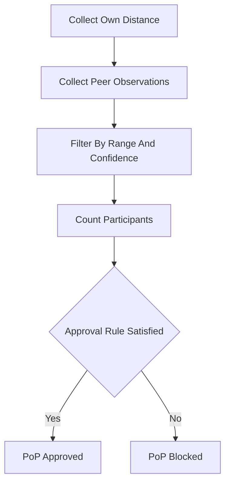
```mermaid
flowchart TD
    A[Collect Own Distance] --> B[Collect Peer Observations]
    B --> C[Filter By Range And Confidence]
    C --> D[Count Participants]
    D --> E{Approval Rule Satisfied}
    E -->|Yes| F[PoP Approved]
    E -->|No| G[PoP Blocked]
```

## 13. Owner Recovery Mode + Math + Mermaid + Image


Flow:
- Validate recovery key hash
- If chain valid then unlock
- If compromised and policy allows, force reset to genesis

Math:
$$
provided\_hash=SHA3\text{-}256(recovery\_key)
$$
$$
valid\_key \iff provided\_hash=stored\_owner\_recovery\_hash
$$

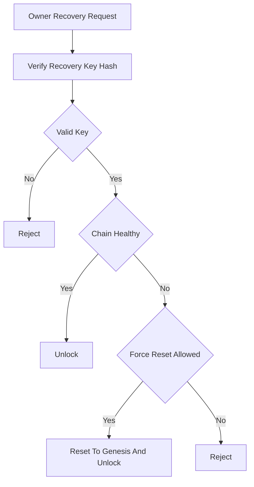
```mermaid
flowchart TD
    A[Owner Recovery Request] --> B[Verify Recovery Key Hash]
    B --> C{Valid Key}
    C -->|No| D[Reject]
    C -->|Yes| E{Chain Healthy}
    E -->|Yes| F[Unlock]
    E -->|No| G{Force Reset Allowed}
    G -->|Yes| H[Reset To Genesis And Unlock]
    G -->|No| I[Reject]
```

## 14. Math Calculation + Mermaid

## Function-wise Math Calculation + Mermaid

### `blockchain.py`
Related image: `image_source/System-Architechture.png`, `image_source/commonication-blockchain-synctrization.png`

#### `dual_hash(data)`

```text
sha2 = SHA2-256(data)
sha3 = SHA3-256(data)
combined = SHA2-256(data + sha3)
```

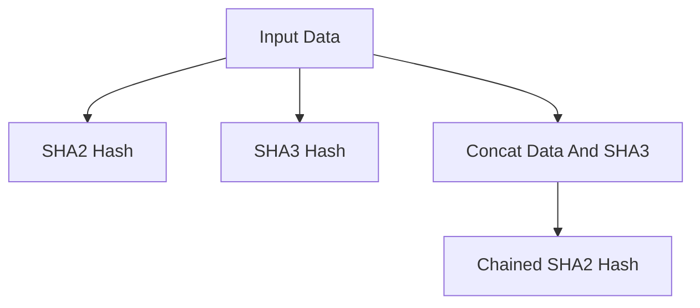
```mermaid
flowchart TD
    A[Input Data] --> B[SHA2 Hash]
    A --> C[SHA3 Hash]
    A --> D[Concat Data And SHA3]
    D --> E[Chained SHA2 Hash]
```

#### `compute_block_hash(...)`

```text
raw = index || timestamp || vehicle_id || telemetry_hash_sha3 || event_hash_sha3 || previous_hash
block_hash = SHA3-256(raw)
```

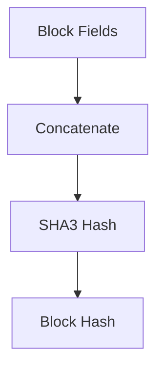
```mermaid
flowchart TD
    A[Block Fields] --> B[Concatenate]
    B --> C[SHA3 Hash]
    C --> D[Block Hash]
```

#### `poa_sign_block(...)`

```text
payload = block_hash || "|" || validator_id || "|" || authority_round
poa_signature = HMAC-SHA256(validator_key, payload)
```

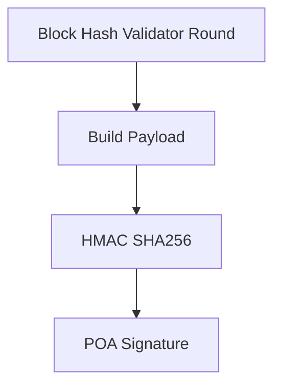
```mermaid
flowchart TD
    A[Block Hash Validator Round] --> B[Build Payload]
    B --> C[HMAC SHA256]
    C --> D[POA Signature]
```

#### `Block.compute_hashes(...)`

```text
telemetry_hash_sha2 = SHA2-256(telemetry_string)
telemetry_hash_sha3 = SHA3-256(telemetry_string)
event_hash_sha2 = SHA2-256(event_data)
event_hash_sha3 = SHA3-256(event_data)
dual_hash_combined = SHA2-256(block_hash) || ":" || SHA3-256(block_hash)
biometric_hash_sha3 = SHA3-256(heart_rate|drowsiness|unwell_flag)
```

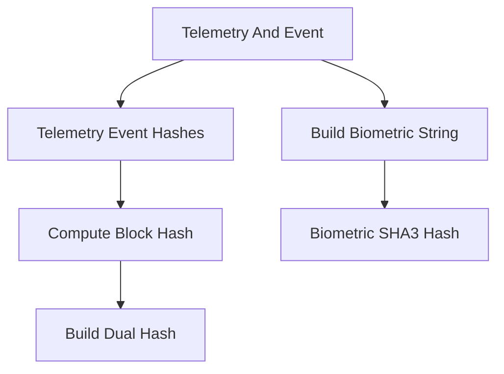
```mermaid
flowchart TD
    A[Telemetry And Event] --> B[Telemetry Event Hashes]
    B --> C[Compute Block Hash]
    C --> D[Build Dual Hash]
    A --> E[Build Biometric String]
    E --> F[Biometric SHA3 Hash]
```

#### `SmartCarCrypto.encrypt(plaintext)`

```text
key = PBKDF2-HMAC-SHA256(password, salt, 100000, 64 bytes)
ciphertext = plaintext XOR keystream
mac = HMAC-SHA256(mac_key, nonce || ciphertext)
package = base64(nonce || mac || ciphertext)
```

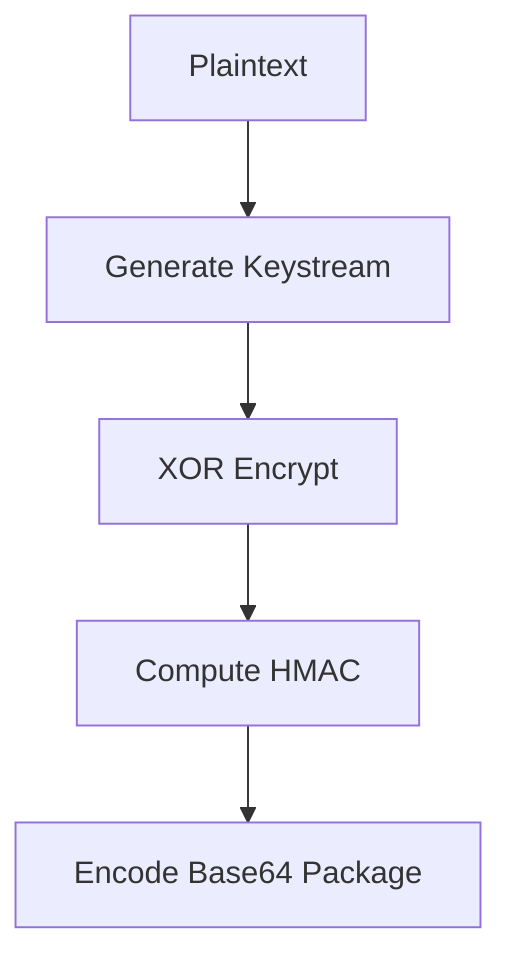
```mermaid
flowchart TD
    A[Plaintext] --> B[Generate Keystream]
    B --> C[XOR Encrypt]
    C --> D[Compute HMAC]
    D --> E[Encode Base64 Package]
```

#### `SmartCarCrypto.decrypt(encrypted_b64)`

```text
expected_mac = HMAC-SHA256(mac_key, nonce || ciphertext)
if mac != expected_mac => reject
plaintext = ciphertext XOR keystream
```

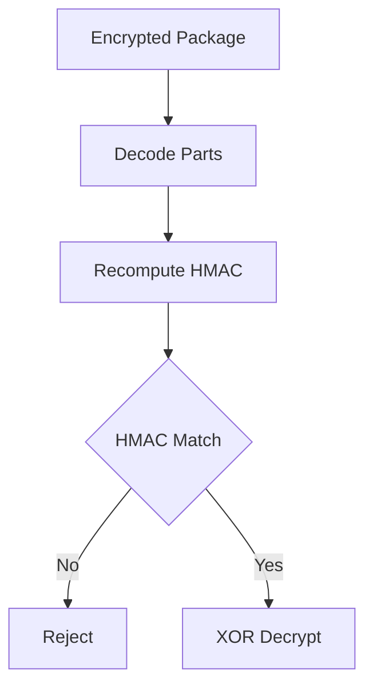
```mermaid
flowchart TD
    A[Encrypted Package] --> B[Decode Parts]
    B --> C[Recompute HMAC]
    C --> D{HMAC Match}
    D -->|No| E[Reject]
    D -->|Yes| F[XOR Decrypt]
```

### `zkp_privacy.py`
Related image: `image_source/Zero-Knowladge-proofs.png`, `image_source/privacy-security-flow.png`

#### `commit(value, blind)`

```text
C = (G^(value mod Q) * H^r) mod P
```

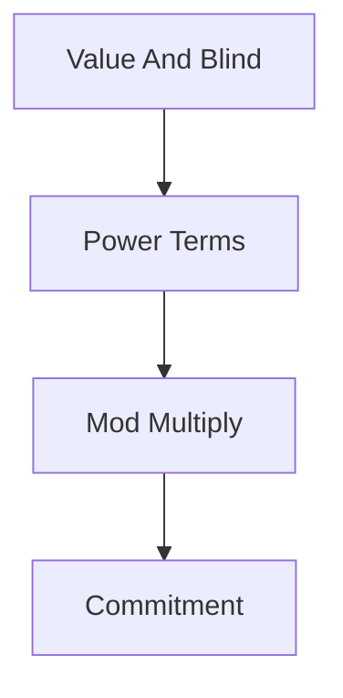
```mermaid
flowchart TD
    A[Value And Blind] --> B[Power Terms]
    B --> C[Mod Multiply]
    C --> D[Commitment]
```

#### `prove_knowledge(...)`

```text
t  = (G^k1 * H^k2) mod P
ch = H(commitment|t|context) mod Q
s1 = (k1 + ch*value) mod Q
s2 = (k2 + ch*blind) mod Q
```

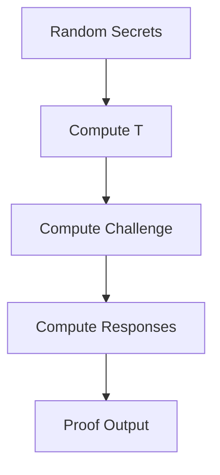
```mermaid
flowchart TD
    A[Random Secrets] --> B[Compute T]
    B --> C[Compute Challenge]
    C --> D[Compute Responses]
    D --> E[Proof Output]
```

#### `verify_knowledge(...)`

```text
lhs = (G^s1 * H^s2) mod P
rhs = (t * commitment^ch) mod P
valid = (lhs == rhs)
```

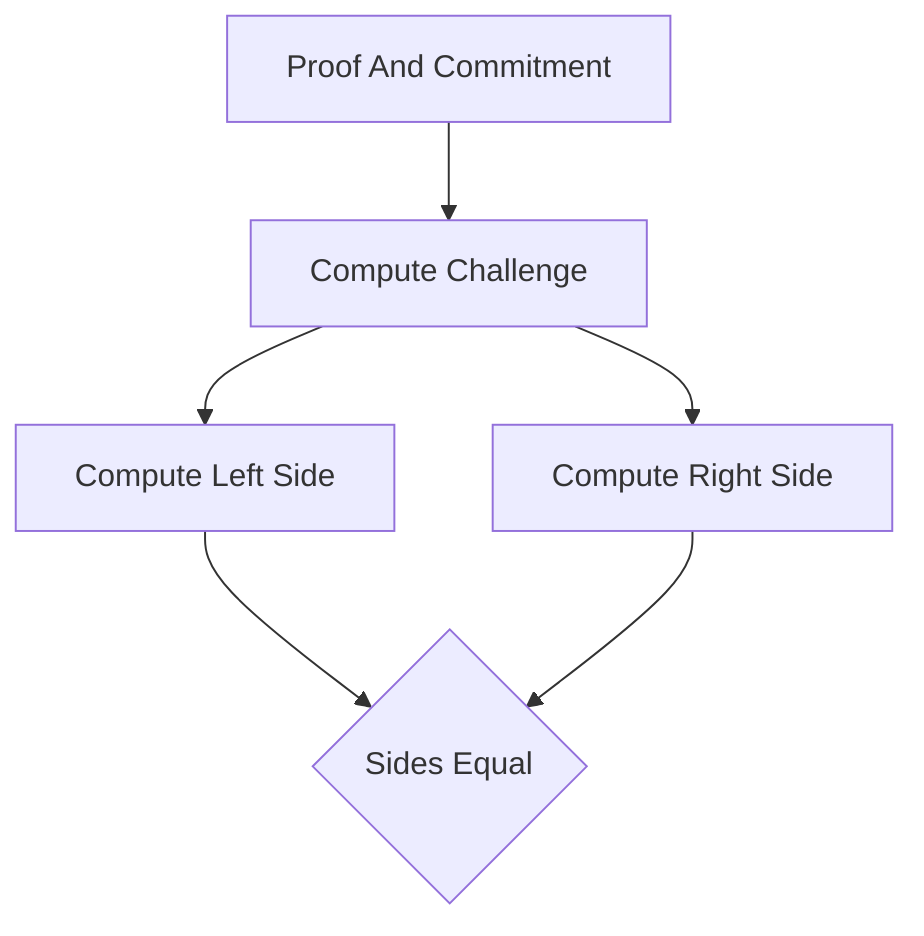
```mermaid
flowchart TD
    A[Proof And Commitment] --> B[Compute Challenge]
    B --> C[Compute Left Side]
    B --> D[Compute Right Side]
    C --> E{Sides Equal}
    D --> E
```

#### `create_speed_limit_proof(...)`

```text
speed = round(speed_kmh), speed >= 0
diff = limit - speed
relation_blind = (r_speed + r_diff) mod Q
```

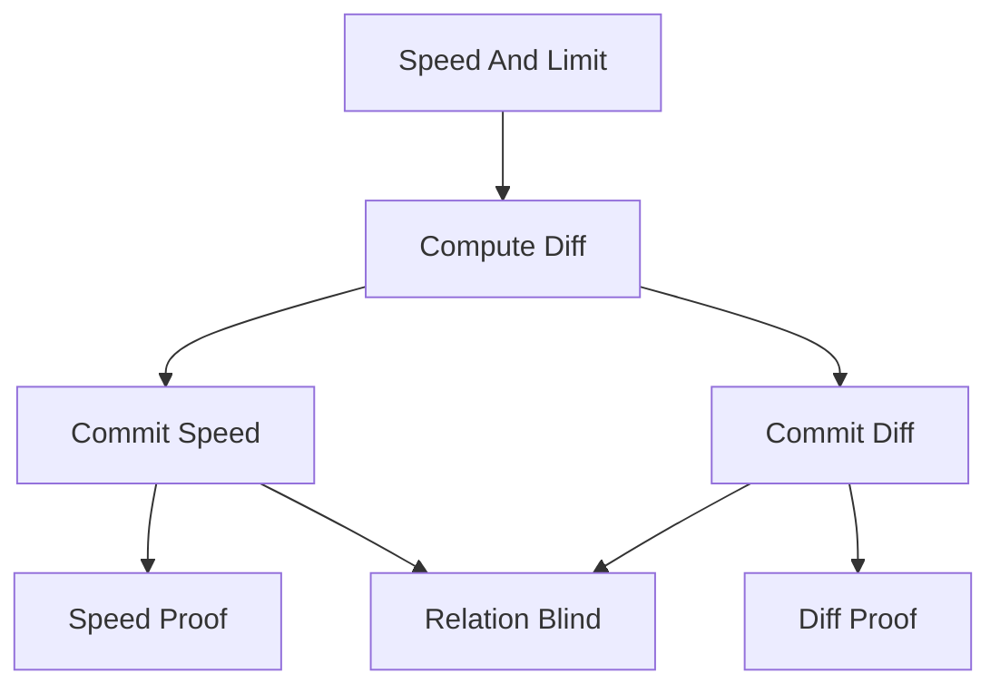
```mermaid
flowchart TD
    A[Speed And Limit] --> B[Compute Diff]
    B --> C[Commit Speed]
    B --> D[Commit Diff]
    C --> E[Speed Proof]
    D --> F[Diff Proof]
    C --> G[Relation Blind]
    D --> G
```

#### `verify_speed_limit_proof(...)`

```text
lhs = (commit_speed * commit_diff) mod P
rhs = (G^limit * H^relation_blind) mod P
valid = proof_speed_ok AND proof_diff_ok AND (lhs == rhs)
```

```mermaid
flowchart TD
    A[Proof Object] --> B[Verify Speed Proof]
    A --> C[Verify Diff Proof]
    A --> D[Verify Relation]
    B --> E{All Valid}
    C --> E
    D --> E
```

### `anomaly_detector.py`
Related image: `image_source/privacy-security-flow.png`

#### `_mean_std(key)`

```text
mean = sum(vals)/n
var  = sum((v-mean)^2)/(n-1)
std  = sqrt(var)
```

```mermaid
flowchart TD
    A[History Values] --> B[Mean]
    B --> C[Variance]
    C --> D[Standard Deviation]
```

#### `detect_telemetry(telemetry)`

```text
z = |(x-mean)/std|
zsum = z_speed + z_accel + z_temp + z_rpm
score += zsum/4 + rule_based_penalties
is_anomaly = (score >= threshold) OR (reason_count >= 2)
```

```mermaid
flowchart TD
    A[Input Telemetry] --> B[Rule Penalties]
    A --> C[Z Score Features]
    B --> D[Total Score]
    C --> D
    D --> E{Anomaly Decision}
```

### `edge_layer.py`
Related image: `image_source/commonication-blockchain-synctrization.png`

#### `_avg(vals)`

```text
avg = sum(vals)/len(vals)
```

```mermaid
flowchart TD
    A[Value List] --> B[Sum Values]
    A --> C[Count Values]
    B --> D[Divide]
    C --> D
```

#### `_flush(event_hint)`

```text
speed      = avg(speed_vals)
obstacle   = min(obs_vals)
brake      = max(brake_vals)
drowsiness = max(drowsy_vals)
```

```mermaid
flowchart TD
    A[Buffered Telemetry] --> B[Extract Vectors]
    B --> C[Average Metrics]
    B --> D[Minimum Metrics]
    B --> E[Maximum Metrics]
    C --> F[Summary Output]
    D --> F
    E --> F
```

### `vehicle_sensors.py`
Related image: `image_source/road_scene.svg`

#### `GPSSimulator.update(speed_kmh, heading_change)`

```text
speed_ms = speed_kmh / 3.6
d = speed_ms * dt / 111111
lat += d * cos(heading_rad)
lon += d * sin(heading_rad)
```

```mermaid
flowchart TD
    A[Speed Heading] --> B[Convert To Meter Per Second]
    B --> C[Compute Angular Distance]
    C --> D[Update Latitude]
    C --> E[Update Longitude]
```

#### `EngineSimulator.update(throttle, dt)`

```text
target_rpm = 800 + (throttle/100)*6200
rpm += (target_rpm - rpm)*0.1
fuel -= (0.00001 + throttle*0.000005)*dt
oil_pressure = 3.5 + (rpm/6000)*1.5 + noise
```

```mermaid
flowchart TD
    A[Throttle And Delta Time] --> B[Target RPM]
    B --> C[Smooth RPM]
    A --> D[Fuel Consumption]
    C --> E[Oil Pressure]
```

#### `EmergencyBrakeController._on_obstacle_detected(obstacle)`

```text
if distance < 30m: brake_pressure = 100
else brake_pressure = (1 - distance/100)*100
```

```mermaid
flowchart TD
    A[Obstacle Distance] --> B{Emergency Zone}
    B -->|No| C[No Brake]
    B -->|Yes| D{Critical Zone}
    D -->|Yes| E[Full Brake]
    D -->|No| F[Linear Brake]
```

### `dashboard.py`
Related image: `image_source/road_scene.svg`, `image_source/project_theam.jpg`

#### `_estimate_distance(box_h)`

```text
distance_m = (1.70 * 850.0) / box_h
```

```mermaid
flowchart TD
    A[Bounding Box Height] --> B[Distance Formula]
    B --> C[Estimated Meter]
```

#### `_draw_speedometer()`

```text
angle_deg = 162 - (speed/220)*144
needle_x = cx + (r-30)*cos(angle)
needle_y = cy - (r-30)*sin(angle)
```

```mermaid
flowchart TD
    A[Current Speed] --> B[Clamp Speed]
    B --> C[Compute Needle Angle]
    C --> D[Compute Cos And Sin]
    D --> E[Needle Position]
```

#### `_update_model()`

```text
target_speed = throttle * 1.6
speed += (target_speed - speed) * 0.12
rpm = 900 + speed * 36
odometer += (speed / 3600) * 0.08
risk = 0.01 + emergency_term + detection_term + obstacle_term + overspeed_term + noise
```

```mermaid
flowchart TD
    A[Throttle And Current State] --> B[Update Speed]
    B --> C[Update RPM Temp Fuel Odometer]
    C --> D[Compute Risk Score]
    D --> E[Append Anomaly History]
```

### `federated_learning.py`
Related image: `image_source/federaated-learning-flow.png`

#### `_sigmoid(x)`

```text
sigmoid(x) = 1 / (1 + exp(-clip(x,-40,40)))
```

```mermaid
flowchart TD
    A[Input Vector] --> B[Clip Input]
    B --> C[Exponential]
    C --> D[Sigmoid Output]
```

#### `FederatedObstacleLearner._extract_features(telemetry)`

```text
speed_norm = clip(speed/180, 0, 1)
accel_norm = clip(|accel|/12, 0, 1)
brake_norm = clip(brake/100, 0, 1)
temp_norm  = clip((temp-60)/60, 0, 1)
near_obstacle = 1 if distance<=35 else 0
hr_risk = 1 if hr<=45 or hr>=140 else 0
```

```mermaid
flowchart TD
    A[Telemetry] --> B[Normalize Continuous Features]
    A --> C[Compute Threshold Features]
    B --> D[Feature Vector]
    C --> D
```

#### `FederatedObstacleLearner._train_batch(x,y,epochs)`

```text
logits = Xw
pred = sigmoid(logits)
grad = X^T(pred - y)/n
w = w - lr*grad
loss = -mean(y*log(pred)+(1-y)*log(1-pred))
```

```mermaid
flowchart TD
    A[Input Batch] --> B[Forward Pass]
    B --> C[Gradient]
    C --> D[Weight Update]
    D --> E[Loss Value]
```

#### `FederatedObstacleLearner._clip_delta(delta, clip_norm)`

```text
n = ||delta||2
if n > c: delta = delta * (c/n)
```

```mermaid
flowchart TD
    A[Delta Vector] --> B[Norm]
    B --> C{Above Clip}
    C -->|Yes| D[Scale Delta]
    C -->|No| E[Keep Delta]
```

#### `FederatedTrainer._mad_filter(vals,k)`

```text
med = median(vals)
mad = median(|vals - med|) + 1e-9
z = |vals - med| / mad
keep = z <= k
```

```mermaid
flowchart TD
    A[Norm Values] --> B[Median]
    B --> C[MAD]
    C --> D[Robust Score]
    D --> E[Keep Mask]
```

#### `FederatedTrainer._robust_weighted_trimmed_mean(...)`

```text
sort each feature column
trim lowest/highest ratio
output_j = sum(col_j * weight_j)/sum(weight_j)
```

```mermaid
flowchart TD
    A[Client Deltas And Weights] --> B[Sort Per Feature]
    B --> C[Trim Tails]
    C --> D[Weighted Mean]
    D --> E[Aggregated Delta]
```

### `v2x_protocol.py`
Related image: `image_source/commonication-blockchain-synctrization.png`

#### `DynamicCryptoAgilityLayer._agility_score(recommended_mode)`

```text
avg_rtt = mean(rtt_history)
mps = msg_count / window_sec
latency_component = min(1, avg_rtt/latency_hi_ms)
traffic_component = min(1, mps/traffic_hi_mps)
score = wL*latency_component + wT*traffic_component
```

```mermaid
flowchart TD
    A[RTT History] --> B[Latency Component]
    C[Message History] --> D[Traffic Component]
    B --> E[Weighted Score]
    D --> E
```

#### `DynamicCryptoAgilityLayer.maybe_switch_mode(...)`

```text
if mode=DILITHIUM and score>=up_thr -> target=SHA3
if mode=SHA3 and score<=down_thr -> target=DILITHIUM
switch only after confirm_count and switch_interval_sec
```

```mermaid
flowchart TD
    A[Current Mode And Score] --> B[Target Mode]
    B --> C[Confirmation Counter]
    C --> D{Ready To Switch}
    D -->|Yes| E[Switch Mode]
    D -->|No| F[Keep Mode]
```

#### `V2XHub._recommend_crypto_mode()`

```text
score = 0.5*traffic_ratio + 0.3*client_load_ratio + 0.2*latency_ratio
mode = SHA3 if score>=0.66 else DILITHIUM
```

```mermaid
flowchart TD
    A[Messages Per Second] --> B[Traffic Ratio]
    C[Client Count] --> D[Load Ratio]
    E[Latency Hint] --> F[Latency Ratio]
    B --> G[Weighted Score]
    D --> G
    F --> G
    G --> H[Choose Crypto Mode]
```

### `network_overhead_analysis.py`
Related image: `image_source/commonication-blockchain-synctrization.png`

#### `analyze()`

```text
overhead_pct = ((protocol_bytes - plain_bytes) / plain_bytes) * 100
```

Applied for:
- `protocol_no_mac_bytes`
- `protocol_hmac_bytes`
- `encrypted_hmac_bytes`

```mermaid
flowchart TD
    A[Plain Bytes] --> B[Protocol Bytes]
    B --> C[Subtract]
    A --> D[Divide]
    C --> D
    D --> E[Multiply By Hundred]
```

### `did_identity.py`
Related image: `image_source/privacy-security-flow.png`

#### `_msg_bits(message)`

```text
digest = SHA3-256(message)
bits[i] = (byte >> shift) & 1
```

```mermaid
flowchart TD
    A[Message] --> B[SHA3 Digest Bytes]
    B --> C[Bit Extraction]
    C --> D[Bit Vector]
```

#### `verify_did_proof(challenge, proof, did_document)`

```text
challenge_hash == SHA3-256(challenge)
for each i: SHA3(signature[i]) == public_pairs[i][bit_i]
```

```mermaid
flowchart TD
    A[Challenge Proof Document] --> B[Challenge Hash Check]
    B --> C[Lamport Verify Loop]
    C --> D{All Matched}
```

### Additional Missing Math (Added)
Related image: `image_source/System-Architechture.png`

#### `blockchain.py::LocalStorageCipher.encrypt_payload(payload)`

```text
key = PBKDF2-HMAC-SHA256(passphrase, salt, iterations, 32 bytes)
ciphertext = AES-256-GCM(key, nonce, plaintext, aad)
```

#### `blockchain.py::_archive_shard_root(blocks)`

```text
leaf_i = SHA3-256(index|block_hash|telemetry_hash|event_hash|previous_hash)
parent = SHA3-256(left || right)
repeat until single root hash
```

#### `blockchain.py::_build_merkle_proof(...)` and `_verify_merkle_proof(...)`

```text
proof step = {position, sibling_hash}
verify by iterative hashing from leaf to root
```

#### `blockchain.py::_evaluate_pop_consensus(...)`

```text
own_valid = min_dist <= own_distance <= max_dist
participants = (1 if own_valid else 0) + selected_neighbor_count
approved = own_valid AND participants >= required_participants
```

#### `dashboard.py::_refresh_v2x_nodes()`

```text
ang  = (now * (0.6 + i*0.08) + i*0.9) mod (2*pi)
dist = 0.2 + ((sin(now*0.3 + i) + 1) * 0.35)
```


## 15. Full System Chain Connect Mermaid
```mermaid
flowchart LR
    S1[Vehicle Sensors] --> S2[Edge Layer]
    S2 --> S3[Anomaly Detector]
    S2 --> S4[ZKP Privacy]
    S3 --> S5[Blockchain Core]
    S4 --> S5
    S5 --> S6[Smart Contracts]
    S5 --> S7[Forensic Blackbox]
    S5 --> S8[Federated Learning]
    S5 --> S9[Pruning And Sharding]
    S5 --> S10[PoP Validation]
    S5 --> S11[DID Verification]
    S5 --> S12[Encrypted Local Storage]
    S5 --> S13[V2X Protocol]
    S13 --> S14[V2X Hub And Peer Nodes]
    S5 --> S15[Dashboard UI]
    S15 --> S16[Owner Recovery And Control]
```

## 16. Full System Description
OmniGuard V2X is a full-stack smart-vehicle security platform where telemetry enters through sensor and hardware interfaces, gets filtered and summarized at edge, is validated for anomaly and privacy, and is committed to a PoA-based blockchain with optional PoP constraints. The system keeps dual-hash block integrity, cryptographically signs validation rounds, and stores sensitive state with encryption-at-rest.

On top of core chain integrity, the platform adds forensic blackbox packaging for incident response, biometric risk-aware safe-mode enforcement, DID-based identity checks, and dynamic smart-contract triggers for automated policy actions. In networked operation, nodes communicate through hardened sync and V2X channels that support dynamic cryptographic agility and post-quantum aware handshake paths.

For long-term resilience, self-healing storage applies pruning, sharding, signed shard anchors, and checkpointed trust verification. In parallel, federated learning allows decentralized on-vehicle model improvement while sharing only clipped and protected updates, preserving privacy while improving cooperative safety.

## Run
```bash
python main.py
```

Optional demos:
```bash
python multi_car_majority_demo.py
python v2x_demo_nodes.py
python pqc_kyber_handshake_test.py
python attacker_fake_zkp.py
python zkp_latency_report.py
python network_overhead_analysis.py
python decentralized_fl_demo.py
python fl_trainer_node.py
```
